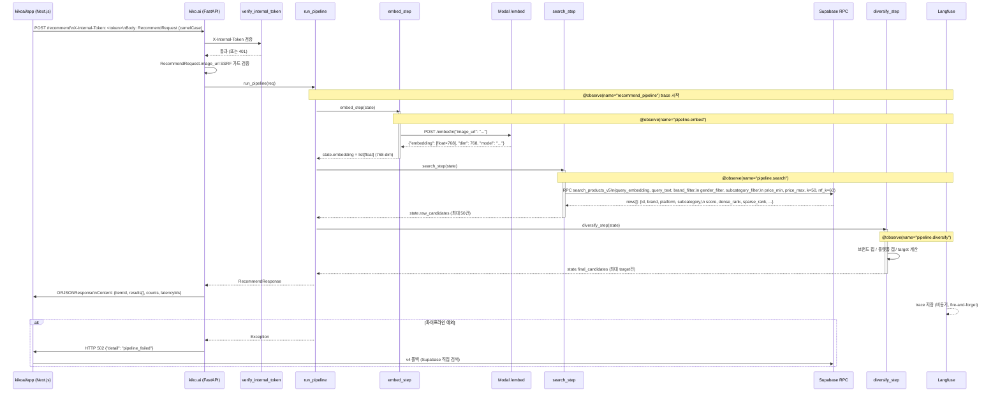

# kiko.ai 데이터 흐름

## 요청 처리 시퀀스

## PipelineState 변환 표

| 단계 | 입력 필드 | 출력 필드 | 부수효과 |
|------|-----------|-----------|---------|
| 초기화 | `RecommendRequest` | `state.request` | — |
| `embed_step` | `state.request.image_url` | `state.embedding: list[float]` (768-dim) | Langfuse span `pipeline.embed`, `state.latency_ms["embed"]` |
| `search_step` | `state.embedding`, `state.request.*` | `state.raw_candidates: list[dict]`, `state.counts["raw"]` | Langfuse span `pipeline.search`, `state.latency_ms["search"]`, 진단 로그 |
| `diversify_step` | `state.raw_candidates`, `state.request.tolerance`, `state.request.brand_filter` | `state.final_candidates: list[dict]`, `state.counts["after_diversify"]`, `state.counts["final"]` | Langfuse span `pipeline.diversify`, `state.latency_ms["diversify"]` |
| `run_pipeline` 응답 조립 | `state.final_candidates`, `state.counts`, `state.latency_ms` | `RecommendResponse` | Langfuse trace `recommend_pipeline` 닫힘 |

## search_products_v5 RPC 인자 및 반환 스키마

### 입력 인자

| 파라미터 | 타입 | 설명 |
|----------|------|------|
| `query_embedding` | `text` (pgvector 포맷 `[v1,v2,...]`) | FashionSigLIP 768-dim 벡터 |
| `query_text` | `text` | 한국어 우선, 없으면 영어 `search_query` |
| `brand_filter` | `text[] \| null` | 브랜드 화이트리스트 (null이면 전체) |
| `gender_filter` | `text[] \| null` | 성별 필터 (현재 진단 목적으로 null 고정) |
| `subcategory_filter` | `text \| null` | 서브카테고리 필터 (현재 진단 목적으로 null 고정) |
| `price_min` | `int \| null` | 최소 가격 |
| `price_max` | `int \| null` | 최대 가격 |
| `tags_filter` | `text[] \| null` | 태그 필터 (null 고정) |
| `k` | `int` | HNSW top-k (기본 50, `SEARCH_DEFAULT_K`) |
| `rrf_k` | `int` | RRF 상수 (60 고정) |

### 반환 컬럼

| 컬럼 | 타입 | 설명 |
|------|------|------|
| `id` | `uuid` | 상품 ID |
| `brand` | `text` | 브랜드명 |
| `name` | `text` | 상품명 |
| `price` | `int` | 가격 |
| `image_url` | `text` | 이미지 URL |
| `product_url` | `text` | 상품 페이지 URL |
| `platform` | `text` | 플랫폼명 |
| `subcategory` | `text` | 서브카테고리 |
| `score` | `float` | RRF 통합 점수 |
| `dense_rank` | `int \| null` | HNSW 순위 (없으면 sparse only) |
| `sparse_rank` | `int \| null` | pgroonga BM25 순위 (없으면 dense only) |

RPC 내부에서 dense(HNSW pgvector)와 sparse(pgroonga BM25) 결과를 RRF(Reciprocal Rank Fusion, k=60)로 융합하여 반환한다.

## 다양성 캡 규칙

### target_count 계산 (tolerance → target)

`_tolerance_to_target_count(tolerance)` 함수:

| tolerance | target_count |
|-----------|-------------|
| 0.0 (tight) | 10 |
| 0.5 (medium) | 15 |
| 1.0 (loose) | 20 |

수식: `int(round(10 + tolerance * 10))`

`final_limit`이 명시된 경우 tolerance 계산을 override한다.

### 브랜드 캡 (brand_cap)

| 조건 | brand_cap |
|------|-----------|
| `brand_filter` 없음 | `SEARCH_BRAND_CAP` = 2 |
| `brand_filter` 있음 | `SEARCH_BRAND_CAP * 3` = 6 |

### 플랫폼 캡 (platform_cap)

항상 `SEARCH_PLATFORM_CAP` = 3 (고정).

### 필터링 순서

`raw_candidates`를 RRF score 내림차순으로 순회하며, 브랜드 캡 초과 시 skip → 플랫폼 캡 초과 시 skip → 통과 시 `out` 추가. `len(out) >= target`이 되면 조기 종료.

## 폴백 경로

kiko.ai가 HTTP 5xx 또는 timeout을 반환하면, kikoai/app(Next.js)이 v4 레거시 검색(Supabase 직접 호출)으로 전환한다. 이 폴백 로직은 kikoai/app 레포에 위치하며 kiko.ai는 관여하지 않는다.
