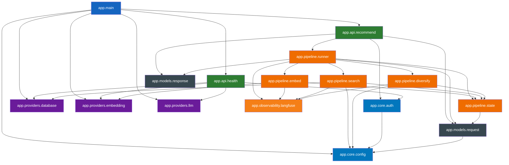

# kiko.ai 의존 관계

## 내부 모듈 의존 그래프

## 외부 패키지 의존

### 런타임 그룹

| 패키지 | 용도 |
|--------|------|
| `fastapi` | ASGI 웹 프레임워크, 라우터, dependency injection |
| `uvicorn` | ASGI 서버 (gunicorn 없이 단독 실행) |
| `pydantic` v2 | 요청/응답 스키마, 필드 검증 |
| `pydantic-settings` | 환경변수 → Settings 자동 매핑 |
| `httpx` | async HTTP 클라이언트 (Modal, LiteLLM 호출) |
| `supabase` (supabase-py) | Supabase async 클라이언트, RPC 호출 |
| `orjson` | 고성능 JSON 직렬화 (`ORJSONResponse`) |

### 관측 그룹

| 패키지 | 용도 | 비고 |
|--------|------|------|
| `langfuse` | 파이프라인 trace, 단계별 latency/score 기록 | v2 lock (`langfuse<3`). no-op 폴백 내장 |

### 개발 그룹

| 패키지 | 용도 |
|--------|------|
| `ruff` | 린트 + 포맷 (line-length=120) |
| `pytest` | 테스트 러너 |
| `pytest-asyncio` | async 테스트 지원 |

### 옵션 그룹 — embed (로컬 배치 전용)

| 패키지 | 용도 | 비고 |
|--------|------|------|
| `torch` | PyTorch 추론 백엔드 | 운영 Docker 이미지 미포함 |
| `open-clip-torch` | OpenCLIP / FashionSigLIP 모델 로딩 | 운영 Docker 이미지 미포함 |
| `Pillow` | 이미지 전처리 | 운영 Docker 이미지 미포함 |
| `tqdm` | 배치 진행 표시 | 운영 Docker 이미지 미포함 |

이 그룹은 `scripts/embed_batch_local.py` 실행 시에만 필요하며, `pyproject.toml` optional 의존으로 분리되어 있다.

## 외부 서비스 의존

| 서비스 | 호출 경로 | 인증 | 비고 |
|--------|-----------|------|------|
| Modal `/embed` | `EmbedProvider.embed_image_url()` via httpx | `Authorization: Bearer <MODAL_EMBED_TOKEN>` (optional) | cold start 최대 90초, warm 시 ~1초 |
| Modal `/embed/batch` | `EmbedProvider.embed_image_urls()` | 동일 | 로컬 배치 스크립트 전용 |
| Supabase RPC `search_products_v5` | `SupabaseProvider.rpc()` via supabase-py | `SUPABASE_SERVICE_ROLE_KEY` | HNSW dense + pgroonga sparse RRF |
| LiteLLM Proxy | `LLMProvider` via httpx | `LITELLM_MASTER_KEY` | 현재 파이프라인 미사용, `/health/ready` 연결 점검만 수행 |
| Langfuse self-host | `@observe` 데코레이터 | `LANGFUSE_PUBLIC_KEY` / `LANGFUSE_SECRET_KEY` | 키 없으면 no-op |
