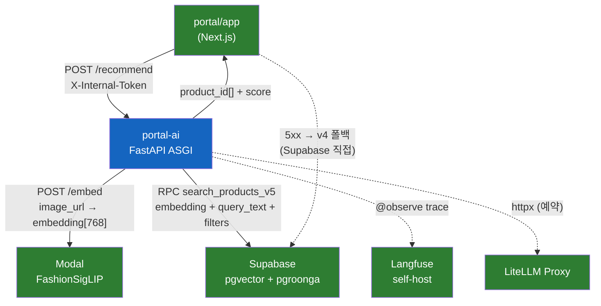

# portal-ai 시스템 개요

## 시스템 경계

portal-ai는 패션 추천 파이프라인의 검색 오케스트레이션 레이어다. portal/app(Next.js 모놀리스)이 분석을 마친 단일 아이템 정보를 POST 요청으로 전달하면, 이미지 임베딩 → 벡터+키워드 하이브리드 검색 → 다양성 필터링을 거쳐 product_id 리스트를 반환한다.

| 레이어 | 소속 | 책임 |
|--------|------|------|
| portal/app (Next.js) | 외부 Caller | Apify 크롤, Cloudflare R2 이미지 저장, GPT-4o-mini Vision 분석, 세션·인증, v4 폴백 |
| **portal/ai (이 프로젝트)** | **이 레포** | **검색 오케스트레이션 — embed → search → diversify** |
| Modal | 외부 GPU 서비스 | FashionSigLIP 추론 (단건 `/embed`, 배치 `/embed/batch`) |
| Supabase | 외부 DB | pgvector HNSW 인덱스 + pgroonga BM25 — `search_products_v5` RPC |
| Langfuse | 외부 관측 | self-hosted trace 저장, 단계별 latency/score 기록 |
| LiteLLM Proxy | 외부 LLM 프록시 | enhance_query 등 LLM 호출 라우팅 (현재 파이프라인 미사용, 예약) |

## 아키텍처 다이어그램



## 핵심 설계 패턴

### plain async state machine

파이프라인은 LangGraph 없이 순수 `async def` 체인으로 구성된다. 각 단계 함수는 `(PipelineState) -> PipelineState` 시그니처를 지켜, 향후 LangGraph 마이그레이션 비용을 0으로 유지한다.

```
run_pipeline
  └─ embed_step(state)   → state.embedding 채움
  └─ search_step(state)  → state.raw_candidates 채움
  └─ diversify_step(state) → state.final_candidates 채움
```

### Provider 싱글톤

`SupabaseProvider`, `EmbedProvider`, `LLMProvider` 세 클래스 모두 클래스변수(`ClassVar`) 기반 싱글톤이다. `lifespan` 훅이 앱 시작 시 `SupabaseProvider.get_client()`를 호출해 워밍업하고, 종료 시 세 Provider를 모두 `close()`한다. 첫 요청 race condition을 방지하는 패턴이다.

### @observe per-step 트레이싱

`app.observability.langfuse.observe` 데코레이터를 `run_pipeline`, `embed_step`, `search_step`, `diversify_step` 각각에 적용한다. Langfuse 키가 없거나 import 실패 시 no-op 폴백으로 앱은 정상 기동된다. v2(`langfuse.decorators.observe`) / v3(`langfuse.observe`) 양쪽 호환.

### SSRF 가드

`RecommendRequest.image_url`에 `@field_validator`를 달아, `ALLOWED_IMAGE_HOSTS` 환경변수에 등록된 suffix와 일치하지 않는 호스트를 차단한다. dev 환경에서는 환경변수가 비어있으면 검증을 스킵한다.

### 내부 토큰 인증

`X-Internal-Token` 헤더를 `verify_internal_token` FastAPI dependency로 검증한다. `INTERNAL_API_TOKEN` 미설정 시 dev로 간주하고 통과시킨다.
