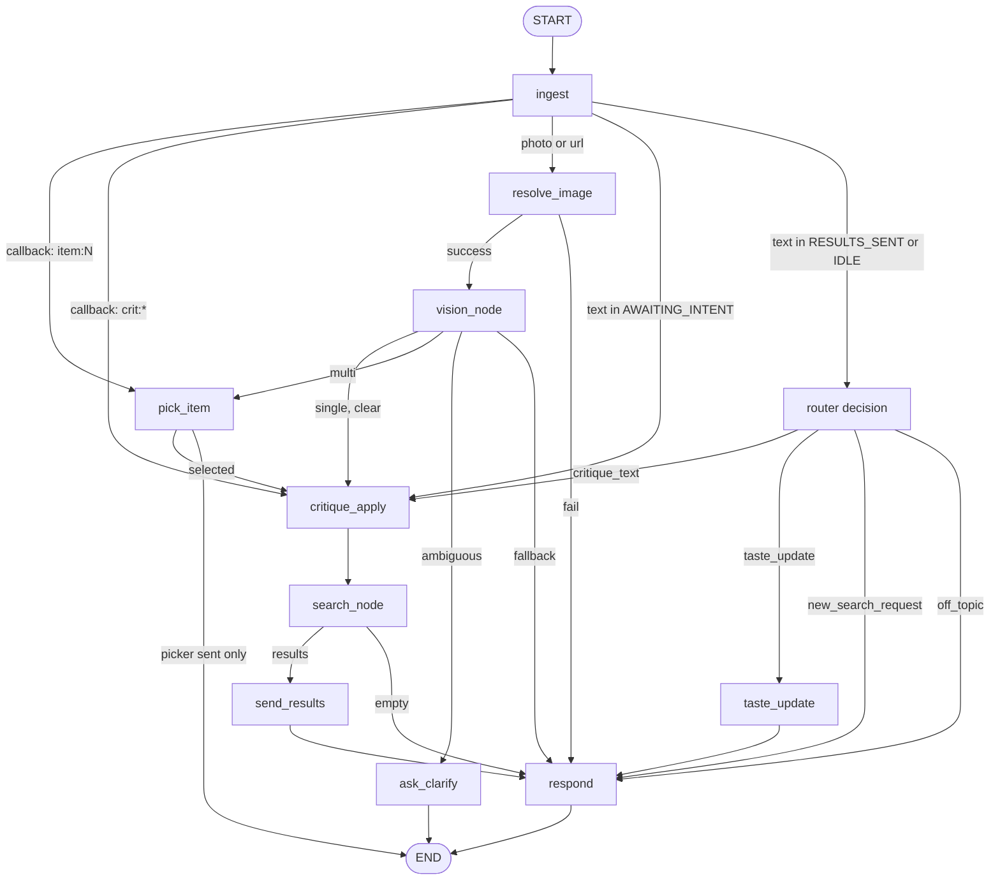

# SPEC-AGENT-001: LangGraph Agent Migration for Telegram Fashion Bot

## HISTORY

- 2026-05-05 (v0.1.0): Initial draft from session-design conversation. Decisions encoded
  for Q1 (LangGraph adoption), Q2 (`langgraph>=1.1.10,<2.0.0` pin), Q3 (10-node inventory
  with new `respond` and `ask_clarify` nodes), Q4 (3-tier Pydantic state design),
  Q5 (Hybrid LLM pattern: existing JSON-extraction modules unchanged, new conversational
  nodes via `langchain-openai` against LiteLLM), Q6 (full topology with all flows
  converging to `respond`), Q7 (Langfuse-only observability via `@observe` + nested
  `CallbackHandler` injected through `RunnableConfig`), Q8 (R1 Big Bang rollout in a
  single PR — dev-only environment, no feature flag, no production traffic). Baseline
  artifacts: `docs/research/conversational-shopping-agents.md` and PR #10
  (commit `09010cb`) which introduced `app/channels/router.py`,
  `app/channels/critique.py`, `app/channels/taste_profile.py`, the tap-critique
  callback buttons, the long-term taste profile, and the silent-dead-end fixes.
  This SPEC layers on top of SPEC-MSG-001 (channel transport, kept) and
  SPEC-PIPELINE-001 (search pipeline, kept) — neither is replaced.

---

## Goal

Replace the in-house 7-state state machine in `app/channels/scenario.py` with a
**LangGraph 1.x StateGraph** that orchestrates the same conversational fashion-shopping
flow as a graph of small, single-purpose nodes. The graph SHALL:

1. Preserve every observable behavior shipped in PR #10 — tap-critique callbacks
   (`crit:*`), free-text critique routing, the long-term taste profile, the
   "no silent dead end" guarantee, and the post-search filter pipeline.
2. Wrap the existing search pipeline (`app/pipeline/runner.py`) and the existing LLM
   modules (`app/channels/vision.py`, `app/channels/router.py`,
   `app/channels/critique.py`, `app/pipeline/enhance_query.py`) without rewriting
   them — they are called from thin nodes.
3. Introduce a generative `respond` node that produces natural-language closing
   text via `langchain-openai` against the existing LiteLLM proxy, so that
   ALL terminal flows (search hit, search empty, off-topic, vision fail, link
   fail, taste-only update) converge to a single English reply path.
4. Open a clean migration path to H3 (multi-image / outfit composition) and to
   tool-calling agents without re-platforming.

The migration is **architecture-only**: there are no new product capabilities
beyond `respond` and `ask_clarify`. Behavior preserved from PR #10 is the
acceptance bar (REQ-COMPAT-*).

This SPEC describes WHAT the graph must do, not HOW each node is implemented.
Implementation details (function signatures, exact prompt strings, retry policies)
belong in `plan.md`.

## Non-Goals

- **Replacing SPEC-MSG-001.** Channel transport (`app/channels/telegram/adapter.py`,
  `app/channels/telegram/webhook.py`, the `MessengerAdapter` ABC, the webhook
  secret-token verification, the `MESSENGER_BACKEND` env switch) is reused
  unchanged. The graph runs strictly between webhook parse and adapter send.
- **Replacing SPEC-PIPELINE-001.** The `embed → enhance_query → search → diversify`
  pipeline runs unchanged inside the new `search_node`.
- **LangGraph checkpointer / persistent graph state.** Each webhook invocation is
  one short-lived `graph.ainvoke(...)` call. Session and TasteProfile remain in
  the existing in-memory stores (`app/channels/session.py`,
  `app/channels/taste_profile.py`) and are accessed by nodes via ContextVar.
  Persistent state is deferred to a post-MVP SPEC.
- **LangSmith tracing.** Explicitly NOT used. Observability is Langfuse-only via
  the existing `app/observability/langfuse.py` `@observe` wrapper plus a
  Langfuse `CallbackHandler` injected through `RunnableConfig` for nested
  node/LLM tracing.
- **Multi-image / outfit composition (H3 territory).** Single inbound image per
  turn is the only supported shape, matching SPEC-MSG-001 P0.
- **Production rollout / feature flag / canary.** Not applicable — this server
  is dev-only, has no production traffic, and the migration ships as a single
  PR (Big Bang per Q8).
- **Migrating the existing 4 LLM modules to langchain wrappers.**
  `vision.py`, `router.py`, `critique.py`, and `enhance_query.py` continue to
  call `LLMProvider.chat()` directly. They are JSON-extraction calls — wrapping
  them adds zero value. This is the "Hybrid" decision in REQ-LLM-002.
- **Tool-calling / function-calling agents inside any node.** All routing in this
  graph is deterministic (or driven by the existing `router.py` JSON output).
  Tool calls are out of scope.
- **Streaming responses to Telegram.** The bot replies in single sends as today;
  `respond` returns a complete string before the adapter dispatches.
- **Multi-turn conversational memory beyond what `messages` already carries.**
  No vector memory, no summarization of older turns. The `messages` reducer
  exists so `respond` can see the immediate prior turn(s) within a single
  webhook invocation if upstream nodes write to it; cross-webhook history
  remains the responsibility of `SessionStore` and `TasteProfileStore`.
- **Group chats, channel posts, payments, Stars, Mini Apps.** 1:1 DM only,
  inherited from SPEC-MSG-001.

## Stakeholders

| Role | Responsibility |
|------|----------------|
| Product / Founder (hchsa77@gmail.com) | Approves the bot's natural-language tone (the new `respond` node is the only user-visible change in copy). Sign-off on REQ-COMPAT-* — every PR #10 behavior is preserved. |
| AI Server Owner (this SPEC) | All work in `app/graphs/`, deletion of `app/channels/scenario.py`, swap-over in `app/api/webhooks/telegram.py`. Owns the per-node tests and the graph-level integration tests. |
| Infra / Bot Operator | No changes required. Webhook URL, `TELEGRAM_BOT_TOKEN`, and `TELEGRAM_WEBHOOK_SECRET` are unaffected. |
| Modal team | Out of scope. Embedding endpoint is called transitively via `pipeline.runner`, unchanged. |
| Langfuse operator | Verifies that the new graph emits a single trace per webhook with named child spans (`ingest`, `resolve_image`, `vision_node`, `pick_item`, `critique_apply`, `search_node`, `send_results`, `taste_update`, `ask_clarify`, `respond`) and that the LLM calls inside `respond` and `ask_clarify` appear as nested generation spans via the `CallbackHandler`. |

---

## Architecture Snapshot (informative)

```
[Telegram webhook]
        │
        ▼
app/api/webhooks/telegram.py
        │   (parses Update via app/channels/telegram/webhook.py — UNCHANGED)
        ▼
                                      ── DELETED ──
                                      app/channels/scenario.py
                                      ── REPLACED BY ──
                                      app/graphs/fashion_bot.py
        ▼
graph = StateGraph(WorkingState).compile()    # cached at import time
await graph.ainvoke(InputState(...), config={"callbacks": [LangfuseCallbackHandler(...)]})
        │
        ▼
   ┌────────────────────────────────────────────────────────────────────┐
   │                          Graph topology                            │
   │                                                                    │
   │  ingest → (router/callback dispatch) → vision/critique/taste/...   │
   │                          │                                         │
   │                          ▼                                         │
   │                       respond  ──►  END                            │
   │                                                                    │
   │  • Each node is a thin function in app/graphs/nodes/*.py           │
   │  • Each node delegates to the existing module it wraps             │
   │  • Routing edges live in app/graphs/routing.py                     │
   │                                                                    │
   └────────────────────────────────────────────────────────────────────┘
        │
        ▼
TelegramAdapter.send_text / send_card    (UNCHANGED — SPEC-MSG-001 REQ-MSG-006)
```

**Reused, untouched modules** (REQ-COMPAT-*):

- `app/channels/telegram/adapter.py`, `app/channels/telegram/webhook.py`
- `app/channels/adapter.py`, `app/channels/factory.py`, `app/channels/schemas.py`
- `app/channels/session.py`, `app/channels/link_resolver.py`
- `app/channels/router.py`, `app/channels/critique.py`, `app/channels/taste_profile.py`
- `app/channels/recommendation.py` (the `RecommendationPort` Protocol + DTO)
- `app/channels/vision.py`
- `app/pipeline/runner.py`, `app/pipeline/state.py`, `app/pipeline/embed.py`,
  `app/pipeline/enhance_query.py`, `app/pipeline/search.py`,
  `app/pipeline/diversify.py`
- `app/providers/llm.py`, `app/providers/embedding.py`, `app/providers/database.py`
- `app/observability/langfuse.py` (extended only by injecting a
  `CallbackHandler` into `RunnableConfig`; no API change)
- `app/core/auth.py`, `app/api/health.py`, `app/api/recommend.py`

**Deleted**:

- `app/channels/scenario.py` — replaced by the graph.
  Test file `tests/test_scenario.py` is rewritten as `tests/test_graph_flows.py`
  exercising the same scenarios end-to-end through the graph.

---

## Module Layout (informative — implementation detail belongs in plan.md)

```
app/graphs/
├── __init__.py
├── fashion_bot.py        # StateGraph build + compile() (cached)
├── state.py              # InputState / WorkingState / OutputState (REQ-STATE-*)
├── routing.py            # _route_after_ingest, _route_after_router_text,
│                         # _route_after_resolve, _route_after_vision,
│                         # _route_after_pick, _route_after_search
└── nodes/
    ├── __init__.py
    ├── ingest.py
    ├── resolve_image.py
    ├── vision.py
    ├── pick_item.py
    ├── critique_apply.py
    ├── search.py
    ├── send_results.py
    ├── taste_update.py
    ├── respond.py
    └── ask_clarify.py

app/channels/scenario.py          # DELETED in this SPEC
tests/test_graph_nodes/           # per-node unit tests (one file per node)
tests/test_graph_flows.py         # integration scenarios (replaces test_scenario.py)
```

---

## Graph Topology (informative — formalized in REQ-AGENT-005)



Notes:

- Every flow except `pick_item (picker sent only)` and `ask_clarify` converges
  to `respond` before `END` (REQ-AGENT-006). Those two terminate immediately
  because they have already sent their own user-facing message (the picker
  carousel or the clarifying question).
- `ask_clarify` only fires when the vision result meets the "weak vision"
  predicate defined in REQ-AGENT-009; it is NOT a generic fallback for
  unclear user intent.
- One webhook = one `graph.ainvoke(...)` execution. There is no checkpointer.
- Each node owns its error handling: a node that raises returns an empty
  state delta and the graph proceeds to its next default edge. The graph
  itself MUST NOT propagate node exceptions to the webhook handler; the
  webhook MUST always respond HTTP 200 to Telegram (per SPEC-MSG-001
  REQ-MSG-001).

---

## State Design (informative — formalized in REQ-STATE-*)

Three Pydantic models, layered narrowest → widest, so each node consumes the
narrowest type that satisfies its needs:

```python
# Conceptual sketch — exact field set is normative (REQ-STATE-002)
class InputState(BaseModel):
    message: ChannelMessage
    chat_id: int
    from_user_id: int | None

class WorkingState(InputState):
    decision: RoutedDecision | None = None
    image_url: str | None = None
    detected_items: list[dict] = []
    selected_item_index: int | None = None
    critique_delta: CritiqueDelta | None = None
    candidates: list[Candidate] = []
    sent_candidates: list[Candidate] = []
    response_text: str | None = None
    presearch_summary: str | None = None
    messages: Annotated[list[BaseMessage], add_messages] = []
    log_events: Annotated[list[str], operator.add] = []

class OutputState(BaseModel):
    sent_count: int
    final_state: SessionState
    response_text: str | None
```

Rationale:

- `InputState` is what the webhook hands to the graph. Read-only for nodes.
- `WorkingState` is the per-turn scratchpad that flows through every node.
  Two reducers are used:
  - `messages: Annotated[list[BaseMessage], add_messages]` so `respond` can see
    upstream node-emitted assistant/system messages without manual appends.
  - `log_events: Annotated[list[str], operator.add]` so any node can append
    structured trace breadcrumbs without overwriting prior nodes' entries.
- `OutputState` is what the webhook reads back to update `SessionStore` and
  to log the final outcome.
- **Session and TasteProfile remain OUTSIDE the graph.** Nodes access them
  through their existing module-level singletons (`session.py` /
  `taste_profile.py`) using a ContextVar bound at the start of the
  webhook handler so that test injections continue to work.

---

## Requirements (EARS)

### Graph Structure (REQ-AGENT-*)

#### REQ-AGENT-001 — Adopt LangGraph 1.x as the orchestration layer [P0]

**THE SYSTEM SHALL** use `langgraph>=1.1.10,<2.0.0` as the orchestration framework
for the inbound-Telegram-message flow, replacing the procedural state machine in
`app/channels/scenario.py`.

**Acceptance criteria**:

- `pyproject.toml` declares `langgraph>=1.1.10,<2.0.0` as a runtime dependency.
- The lockfile (`uv.lock`) resolves to a `langgraph` version inside that range
  and outside any `1.2.0a*` alpha tag.
- `langgraph` is imported only from `app/graphs/**`. `grep -R "^from langgraph" app/`
  returns no hits outside `app/graphs/`.
- The graph object is constructed once at module import time (compile cached at
  module level in `app/graphs/fashion_bot.py`); each webhook invocation reuses
  the compiled instance.

#### REQ-AGENT-002 — Adopt langchain-core and langchain-openai for new conversational nodes [P0]

**THE SYSTEM SHALL** declare `langchain-core>=0.3,<1.0` and
`langchain-openai>=0.3,<1.0` as runtime dependencies, used exclusively by the
new `respond` and `ask_clarify` nodes (REQ-LLM-002).

**Acceptance criteria**:

- `pyproject.toml` declares both packages within the stated version ranges.
- `langchain_openai.ChatOpenAI` is imported only from
  `app/graphs/nodes/respond.py` and `app/graphs/nodes/ask_clarify.py`.
- `langchain_core.messages.BaseMessage` is imported by `app/graphs/state.py`
  (for the `messages` field type) and by the two nodes above.
- No other module imports `langchain_*`.

#### REQ-AGENT-003 — Adopt langfuse[langchain] for nested LLM tracing [P0]

**THE SYSTEM SHALL** declare a langchain-aware Langfuse package (either
`langfuse[langchain]` extra or the standalone `langfuse-langchain` distribution,
whichever satisfies the existing pinned `langfuse` major version) so that a
`CallbackHandler` can be passed to LangChain `Runnable` invocations.

**Acceptance criteria**:

- `pyproject.toml` adds the langchain-handler-providing distribution.
- `from langfuse.langchain import CallbackHandler` (or the equivalent canonical
  import path of the chosen distribution) succeeds at import time.
- The handler is constructed inside the webhook entrypoint (or graph entrypoint)
  and injected via `RunnableConfig.callbacks` (REQ-OBSV-002).

#### REQ-AGENT-004 — Define exactly ten graph nodes with the responsibilities below [P0]

**THE SYSTEM SHALL** implement the following 10 nodes in `app/graphs/nodes/`,
one node per file, each as a module-level async function (no classes, no mixins):

| # | Node | Wraps / Implements | Description |
|---|------|--------------------|-------------|
| 1 | `ingest` | `app/channels/telegram/webhook.py` parsed `ChannelMessage`; invokes `router.py` for ambiguous text branches | Normalizes the inbound message into `WorkingState`, invokes the existing router for ambiguous text, and computes the routing decision used by the conditional edge. |
| 2 | `resolve_image` | `app/channels/link_resolver.py::resolve(url)` | Resolves Pinterest / og:image URLs to a single image URL; on failure leaves `image_url=None` and lets the conditional edge route to `respond`. |
| 3 | `vision_node` | `app/channels/vision.py::extract` | Calls Vision (LiteLLM `gpt-4o-mini`) on the image, populates `detected_items`. Strength of result drives the conditional edge (clear / multi / ambiguous / fallback). |
| 4 | `pick_item` | Existing picker-send logic from PR #10 (`scenario.py` handlers being replaced) | Sends the multi-item picker carousel via the channel adapter and either ends (carousel sent, awaiting tap) or proceeds with the user's tap selection. |
| 5 | `ask_clarify` | NEW | Generates a single clarifying question via `langchain-openai` against LiteLLM, sends it via the adapter, and ends. Fires only when REQ-AGENT-009's weak-vision predicate is true. |
| 6 | `critique_apply` | `app/channels/critique.py::parse_callback` (callback path) and the router decision (text path) | Builds a `CritiqueDelta` from either a `crit:*` callback payload or the router output, writes it to `WorkingState`, and hands off to `search_node`. |
| 7 | `search_node` | `app/pipeline/runner.py` plus the post-search filters in `app/channels/recommendation.py::_apply_post_filters` | Runs the unchanged search pipeline (embed → enhance_query → search → diversify) followed by critique-aware post-filters. Empty result routes to `respond`. |
| 8 | `send_results` | Existing card-send logic from PR #10 | Renders the result cards via the channel adapter, caches `last_results` in the session store, and accumulates `shown_product_ids`. |
| 9 | `taste_update` | `app/channels/taste_profile.py::reinforce_*` family | Applies a `TasteUpdate` to the `TasteProfileStore` and proceeds to `respond` for confirmation copy. |
| 10 | `respond` | NEW | Generates the final natural-language reply via `langchain-openai` against LiteLLM, sends it via the adapter, and ends the graph. ALL non-picker / non-clarify flows pass through `respond` before `END` (REQ-AGENT-006). |

**Acceptance criteria**:

- `app/graphs/nodes/` contains exactly the 10 files listed above plus `__init__.py`.
- Each node is a module-level `async def` function whose first parameter is the
  state slice it consumes and which returns a `dict` (state delta) — no class
  methods, no mixins.
- Each node's docstring lists the upstream module(s) it wraps (so future
  refactors stay traceable).
- Per-node unit tests live under `tests/test_graph_nodes/` with one file per
  node (e.g. `tests/test_graph_nodes/test_resolve_image.py`).

#### REQ-AGENT-005 — Implement the topology exactly as specified [P0]

**THE SYSTEM SHALL** wire the graph edges to match the topology in the
"Graph Topology" section above. Routing functions live in
`app/graphs/routing.py`.

**Acceptance criteria**:

- `START → ingest` is the only entry edge.
- `ingest` is followed by a conditional edge whose branches are:
  `pick_item` (callback `item:N`), `critique_apply` (callback `crit:*` OR text
  in `AWAITING_INTENT`), `resolve_image` (photo OR url), and a
  `router_text_decision` branch (text in `RESULTS_SENT` or `IDLE`) which calls
  `router.py` and dispatches to `critique_apply`, `taste_update`, or `respond`
  based on `RoutedDecision.intent`.
- `resolve_image` is followed by a conditional edge: `vision_node` on success,
  `respond` on failure.
- `vision_node` is followed by a conditional edge with four branches matching
  the four vision outcomes (single+clear → `critique_apply`,
  multi → `pick_item`, ambiguous → `ask_clarify`, fallback → `respond`).
- `pick_item` is followed by a conditional edge: on a user selection within the
  same webhook (callback path) → `critique_apply`; on picker-sent-only → `END`.
- `taste_update → respond → END`.
- `critique_apply → search_node`.
- `search_node` is followed by a conditional edge: results present →
  `send_results`; empty → `respond`.
- `send_results → respond → END`.
- `ask_clarify → END`.
- A test `tests/test_graph_topology.py` (or equivalent) asserts the edge set
  programmatically (e.g., by introspecting the compiled graph or by snapshot
  test of the Mermaid string) so the diagram and the implementation cannot
  drift.

#### REQ-AGENT-006 — All non-terminal flows converge to `respond` [P0]

**THE SYSTEM SHALL** route every flow that has not already sent a user-visible
message in the current webhook through the `respond` node before reaching `END`.
The only two flows allowed to skip `respond` are:

1. `pick_item` when it has just sent the picker carousel and is awaiting a tap
   (no further reply is appropriate until the user picks).
2. `ask_clarify` (the clarifying question itself IS the user-visible message).

**Acceptance criteria**:

- Static analysis of the topology (REQ-AGENT-005's test) confirms that every
  edge that is NOT one of the two allowed exceptions terminates at `respond`.
- An integration test exercises the empty-search-result flow and asserts that
  exactly one outbound text message is sent (the one produced by `respond`).
- An integration test exercises the link-resolver-failure flow and asserts the
  same.
- An integration test exercises the off-topic router decision and asserts the
  same.
- An integration test exercises the taste-only update flow (e.g., a
  reinforcement message with no new search) and asserts that `respond` issues
  a confirmation reply.

#### REQ-AGENT-007 — Each node owns its error handling; node exceptions never propagate to the webhook [P0]

**IF** a node's wrapped call raises an exception, **THEN** the node **SHALL**
log the failure to `WorkingState.log_events` (and to the standard logger),
return an empty state delta (`{}` or a delta that signals "no update"), and
allow the graph to proceed to its next default edge so that the webhook still
returns HTTP 200.

**Acceptance criteria**:

- Per-node tests inject a synthetic exception into the wrapped dependency
  (e.g., `vision.extract` raises `httpx.TimeoutException`) and assert that:
  1. The node returns without raising.
  2. The graph still reaches `respond` and terminates.
  3. A breadcrumb appears in `log_events` containing the node name, the
     exception class, and a short reason.
- An integration test simulates a `vision_node` exception and verifies the
  webhook handler receives the graph result (does not see the exception).
- The webhook handler's HTTP 200 contract from SPEC-MSG-001 REQ-MSG-002
  remains intact.

#### REQ-AGENT-008 — One webhook = one graph execution [P0]

**WHEN** a verified Telegram webhook is received, **THE SYSTEM SHALL** invoke
`graph.ainvoke(InputState(...), config=...)` exactly once and use its
`OutputState` to update `SessionStore` for the chat.

**Acceptance criteria**:

- `app/api/webhooks/telegram.py` contains exactly one `await graph.ainvoke(...)`
  call site for the Telegram webhook flow.
- No checkpointer is configured on the compiled graph
  (`StateGraph(...).compile()` is called without a `checkpointer` argument).
- An integration test sends two consecutive webhook payloads to the handler
  and asserts that two distinct graph executions occurred (e.g., by counting
  Langfuse trace starts).

#### REQ-AGENT-009 — `ask_clarify` fires only on the "weak vision" predicate [P0]

**WHEN** `vision_node` returns a result whose primary item description is
shorter than a configured token threshold OR consists of a single ambiguous
label (e.g., `"item"`, `"clothing"`, or any value matching the configured
ambiguous-label denylist), **THE SYSTEM SHALL** route to `ask_clarify` instead
of `critique_apply`. The clarifying-question node MUST NOT fire on user-intent
ambiguity (which is the router's job) or on any other non-vision condition.

**Acceptance criteria**:

- The threshold and the denylist are configurable via env (e.g.,
  `ASK_CLARIFY_MIN_DESC_TOKENS`, `ASK_CLARIFY_AMBIGUOUS_LABELS`) with safe
  defaults documented in the env table below.
- A unit test feeds `vision_node` outputs of length below the threshold and
  asserts the router function returns the `ask_clarify` branch.
- A unit test feeds a clear single-item vision result and asserts the router
  function returns the `critique_apply` branch.
- A unit test feeds a multi-item vision result and asserts the router function
  returns the `pick_item` branch (multi-item dominates the "ambiguous"
  classification — the picker is the better UX).
- A unit test asserts that an off-topic user text in `RESULTS_SENT` routes
  through `router_text_decision` to `respond`, NEVER to `ask_clarify`.

#### REQ-AGENT-010 — Picker-sent-only path SHALL NOT call `respond` [P0]

**WHEN** `pick_item` has sent the picker carousel and there is no in-band
selection in the current webhook, **THE SYSTEM SHALL** route directly to
`END` without invoking `respond`.

**Acceptance criteria**:

- An integration test simulates a multi-item vision result and asserts that
  exactly the picker carousel is sent (no follow-up `respond` text).
- An integration test simulates a subsequent `item:N` callback and asserts the
  graph routes through `pick_item → critique_apply → search_node → send_results
  → respond → END`.

---

### State Design (REQ-STATE-*)

#### REQ-STATE-001 — Three-tier Pydantic state with InputState / WorkingState / OutputState [P0]

**THE SYSTEM SHALL** define three Pydantic v2 `BaseModel` classes in
`app/graphs/state.py`: `InputState`, `WorkingState`, and `OutputState`.
`WorkingState` extends `InputState`. Each node consumes the narrowest type
that meets its needs.

**Acceptance criteria**:

- `app/graphs/state.py` defines exactly the three models named above.
- `WorkingState` inherits from `InputState` (`class WorkingState(InputState):`).
- `OutputState` is independent (used only at graph completion to surface the
  final result back to the webhook handler).
- The `StateGraph` is parameterized with `WorkingState` for internal flow.
- All nodes accept their first parameter as a typed Pydantic model (not a
  raw `dict`).

#### REQ-STATE-002 — WorkingState carries exactly the fields enumerated below [P0]

**THE SYSTEM SHALL** include the following fields on `WorkingState` (in addition
to the `InputState` fields it inherits):

| Field | Type | Default | Reducer | Purpose |
|-------|------|---------|---------|---------|
| `decision` | `RoutedDecision \| None` | `None` | (none) | Output of `router.py` for ambiguous text branches. |
| `image_url` | `str \| None` | `None` | (none) | Resolved image URL after `resolve_image`. |
| `detected_items` | `list[dict]` | `[]` | (none) | Output of `vision_node`. |
| `selected_item_index` | `int \| None` | `None` | (none) | Index chosen via picker callback. |
| `critique_delta` | `CritiqueDelta \| None` | `None` | (none) | Built by `critique_apply`. |
| `candidates` | `list[Candidate]` | `[]` | (none) | Pipeline output before send. |
| `sent_candidates` | `list[Candidate]` | `[]` | (none) | What `send_results` actually dispatched. |
| `response_text` | `str \| None` | `None` | (none) | Final natural-language reply from `respond`. |
| `presearch_summary` | `str \| None` | `None` | (none) | Optional short summary built before search (used by `respond` for context). |
| `messages` | `list[BaseMessage]` | `[]` | `add_messages` | Conversation messages reducer so `respond` sees prior in-turn assistant/system messages. |
| `log_events` | `list[str]` | `[]` | `operator.add` | Append-only structured breadcrumb log written by every node. |

**Acceptance criteria**:

- `app/graphs/state.py` declares each field with the exact type above.
- The `messages` field uses `Annotated[list[BaseMessage], add_messages]`.
- The `log_events` field uses `Annotated[list[str], operator.add]`.
- A unit test instantiates `WorkingState()` with only the inherited
  `InputState` fields and asserts all other fields take their declared defaults.
- A unit test confirms that two independent state deltas appending to
  `log_events` from different nodes produce a concatenated list (reducer works).

#### REQ-STATE-003 — InputState fields [P0]

**THE SYSTEM SHALL** define `InputState` with exactly these fields:

| Field | Type | Source |
|-------|------|--------|
| `message` | `ChannelMessage` | Parsed by `app/channels/telegram/webhook.py` |
| `chat_id` | `int` | Telegram `chat.id` |
| `from_user_id` | `int \| None` | Telegram `from.id` (may be absent for channel posts, but channel posts are out of scope per SPEC-MSG-001) |

**Acceptance criteria**:

- The webhook handler constructs `InputState` from the parsed Telegram update
  and passes it to `graph.ainvoke(...)`.
- A unit test verifies that `InputState` rejects extra fields (Pydantic v2
  `model_config = ConfigDict(extra="forbid")`).

#### REQ-STATE-004 — OutputState fields [P0]

**THE SYSTEM SHALL** define `OutputState` with exactly these fields:

| Field | Type | Purpose |
|-------|------|---------|
| `sent_count` | `int` | Number of outbound messages dispatched in this turn (cards + final text). |
| `final_state` | `SessionState` | The new session state to persist via `SessionStore`. |
| `response_text` | `str \| None` | Mirrors `WorkingState.response_text` for logging. |

**Acceptance criteria**:

- The webhook handler reads `OutputState` (or the equivalent end-of-graph
  state slice) and uses `final_state` to update `SessionStore`.
- A unit test verifies `sent_count >= 1` for any flow that exercises `respond`.

#### REQ-STATE-005 — Session and TasteProfile remain outside the graph [P0]

**THE SYSTEM SHALL NOT** carry the entire session map or the entire taste
profile inside `WorkingState`. Nodes that need read or write access to those
stores SHALL go through the existing module APIs
(`app/channels/session.py::SessionStore`,
`app/channels/taste_profile.py::TasteProfileStore`), which themselves remain
in-memory singletons accessed via the existing factory / ContextVar patterns.

**Acceptance criteria**:

- `WorkingState` contains no field of type `SessionStore` or
  `TasteProfileStore`.
- The `taste_update` node delegates to the existing reinforcement helpers
  (`taste_profile.reinforce_*`).
- The `send_results` node updates the per-chat `last_results` and accumulates
  `shown_product_ids` via the existing `SessionStore` API; no graph-level
  persistence is added.
- A test using a swapped-in `InMemorySessionStore` (via the existing
  `set_store_factory` / `set_store` / `reset_store` injection points) confirms
  that test isolation continues to work.

---

### LLM Pattern (REQ-LLM-*)

#### REQ-LLM-001 — Existing 4 LLM modules continue using `LLMProvider.chat()` directly [P0]

**THE SYSTEM SHALL NOT** modify the LLM call paths inside `app/channels/vision.py`,
`app/channels/router.py`, `app/channels/critique.py`, or
`app/pipeline/enhance_query.py`. They continue to call `LLMProvider.chat()`
from `app/providers/llm.py` as they do today.

**Acceptance criteria**:

- `git diff` between the SPEC-AGENT-001 PR and the prior state shows zero
  changes inside the four files listed above (excluding pure import-path
  adjustments if a node imports a public function from one of them).
- The acceptance criteria of SPEC-PIPELINE-001 (REQ-PIPELINE-001 through
  REQ-PIPELINE-005) remain satisfied unchanged.
- Existing tests covering vision, router, critique, and enhance_query continue
  to pass without modification.

#### REQ-LLM-002 — New `respond` and `ask_clarify` nodes use `langchain-openai` against LiteLLM [P0]

**THE SYSTEM SHALL** instantiate `langchain_openai.ChatOpenAI` inside the new
`respond` and `ask_clarify` nodes (only) configured to point at the existing
LiteLLM proxy via `base_url=settings.LITELLM_BASE_URL + "/v1"`,
`api_key=settings.LITELLM_MASTER_KEY`, `model=settings.RESPONSE_MODEL`,
and a temperature appropriate for short conversational replies.

**Acceptance criteria**:

- Two `ChatOpenAI` instances exist: one in `app/graphs/nodes/respond.py` and
  one in `app/graphs/nodes/ask_clarify.py`. They MAY be module-level singletons
  for connection reuse.
- Both instances use `base_url = settings.LITELLM_BASE_URL + "/v1"` and
  `api_key = settings.LITELLM_MASTER_KEY` (no direct OpenAI credentials).
- Both instances pass `temperature=0.7` (or another value documented in
  `plan.md`); `respond` and `ask_clarify` MAY use different temperatures.
- A unit test patches `ChatOpenAI` and asserts the constructor receives the
  documented `base_url`, `api_key`, and `model`.
- An integration test against a stub LiteLLM endpoint confirms a real HTTP
  call is issued through the proxy (matched URL prefix).

#### REQ-LLM-003 — New env vars: `RESPONSE_MODEL`, `RESPONSE_TIMEOUT_MS`, `RESPONSE_MAX_TOKENS` [P0]

**THE SYSTEM SHALL** add the following settings to `app/core/config.py` with
the defaults shown:

| Var | Type | Default | Purpose |
|-----|------|---------|---------|
| `RESPONSE_MODEL` | `str` | `"gpt-4o-mini"` | Model id passed to LiteLLM via `ChatOpenAI(model=...)` for `respond` and `ask_clarify`. |
| `RESPONSE_TIMEOUT_MS` | `int` | `5000` | Per-call timeout for `respond` and `ask_clarify` LLM invocations. |
| `RESPONSE_MAX_TOKENS` | `int` | `200` | Maximum output tokens for `respond` (short conversational replies). |

**Acceptance criteria**:

- `app/core/config.py` declares all three settings with the documented defaults.
- `.env.example` lists all three with placeholder/default values.
- Both `respond` and `ask_clarify` honor `RESPONSE_TIMEOUT_MS` (e.g., via
  `ChatOpenAI(timeout=settings.RESPONSE_TIMEOUT_MS / 1000)` or an equivalent
  surrounding `asyncio.wait_for`).
- `respond` honors `RESPONSE_MAX_TOKENS`. `ask_clarify` MAY use a smaller
  cap documented in `plan.md`.
- A unit test verifies that an LLM timeout in `respond` returns a safe
  fallback string (REQ-AGENT-007 still applies — the node never raises).

#### REQ-LLM-004 — `respond` MUST produce a single English string in one call [P0]

**WHEN** `respond` runs, **THE SYSTEM SHALL** issue exactly one synchronous LLM
call (no streaming, no chained tool calls, no fan-out) that returns a single
plain-text string suitable for a Telegram `sendMessage` body.

**Acceptance criteria**:

- The string is at most `RESPONSE_MAX_TOKENS` tokens (~600-800 characters
  bounded by the model).
- The string contains no markdown headings, no code fences, and no JSON.
- Reply language is English (`BOT_LANGUAGE=en` from SPEC-MSG-001 REQ-MSG-005
  is honored).
- On LLM failure (timeout, 4xx, 5xx, parse error), `respond` falls back to a
  hard-coded English sentence appropriate for the current `WorkingState`
  (e.g., for empty search: `"Hmm, I couldn't find a match — try another
  angle or a different photo."`, mirroring SPEC-MSG-001 REQ-MSG-007).
- A unit test asserts the fallback string is dispatched through the adapter
  when the LLM raises.

#### REQ-LLM-005 — `ask_clarify` MUST produce a single English question in one call [P0]

**WHEN** `ask_clarify` runs, **THE SYSTEM SHALL** issue exactly one LLM call
that returns a short clarifying question (e.g., `"Got it — is that a top, a
dress, or outerwear?"`) to be sent via the channel adapter.

**Acceptance criteria**:

- The question is shorter than the `respond` cap (documented threshold in
  `plan.md`).
- On LLM failure, `ask_clarify` falls back to a hard-coded English question
  derived from the weak-vision predicate signal.
- A unit test asserts that on success exactly one `sendMessage` is dispatched
  and the graph terminates without invoking `respond`.

---

### Observability (REQ-OBSV-*)

#### REQ-OBSV-001 — Each webhook produces exactly one Langfuse trace via `@observe` [P0]

**WHEN** a verified webhook is processed, **THE SYSTEM SHALL** open a single
Langfuse trace using the existing `app/observability/langfuse.py` `@observe`
wrapper at the graph-entry boundary (either decorating the webhook handler's
graph-invocation path or a thin wrapper around `graph.ainvoke`). The trace
SHALL be tagged with `channel=telegram`, `chat_id_hash=<sha256(chat_id)[:16]>`,
and `graph=fashion_bot`.

**Acceptance criteria**:

- One trace per webhook (REQ-AGENT-008 prerequisite).
- `chat_id` and `from_user_id` MUST NOT appear raw in any Langfuse field; only
  the SHA-256 prefix is used (`session_id = sha256(chat_id)[:16]`,
  `user_id = sha256(from_user_id)[:16]` when present).
- The trace SHALL include the metadata dict described in REQ-OBSV-003.
- If `LANGFUSE_*` env vars are unset, the existing no-op fallback in
  `langfuse.py` continues to apply — no errors raised, no behavior change.
- This requirement extends (does not replace) SPEC-MSG-001 REQ-MSG-009.

#### REQ-OBSV-002 — Nested LLM and node spans via Langfuse `CallbackHandler` injected through `RunnableConfig` [P0]

**WHEN** the graph executes, **THE SYSTEM SHALL** pass a Langfuse
`CallbackHandler` to `graph.ainvoke(state, config={"callbacks": [handler]})`
so that langchain-driven LLM calls inside `respond` and `ask_clarify` appear
as nested generation spans under the per-webhook trace.

**Acceptance criteria**:

- A single `CallbackHandler` instance is created per webhook (NOT module-level
  — handlers carry per-trace context).
- The handler is injected into `RunnableConfig.callbacks`; nodes that call the
  `ChatOpenAI` runnable receive `config` so the runnable's `.ainvoke(...,
  config=config)` path reaches the handler.
- An integration test against a Langfuse mock asserts that for a flow
  exercising `respond`, the trace tree contains: root span (graph) → child
  span (node `respond`) → grandchild generation span (LiteLLM call). The
  exact span names follow Langfuse + langchain conventions; this SPEC only
  requires that the parent-child relationship is preserved.
- The existing `app/observability/langfuse.py` no-op fallback continues to
  cover the case where `LANGFUSE_*` env vars are unset (the handler is then
  a no-op handler or is skipped — `plan.md` documents the chosen approach).

#### REQ-OBSV-003 — Trace metadata fields [P0]

**THE SYSTEM SHALL** populate the per-webhook Langfuse trace metadata with at
minimum the following fields:

| Field | Source | Purpose |
|-------|--------|---------|
| `state` | Current `SessionState` at graph entry | Debugging the state machine. |
| `intent` | `RoutedDecision.intent` when set | Understanding router behavior. |
| `delta` | Short summary of `CritiqueDelta` (e.g., `"price_max=80, exclude=[brand_x]"`) | Understanding tap-critique impact. |
| `taste_profile_size` | `len(TasteProfile.signals)` for the user | Detecting taste-profile growth. |

**Acceptance criteria**:

- All four fields appear under `trace.metadata` (or the langfuse equivalent) for
  every webhook trace.
- A trace from a flow that does not invoke `router.py` (e.g., a pure
  callback-driven path) records `intent=None` rather than omitting the field.
- A unit test asserts the metadata builder produces the four keys for a
  representative state.

#### REQ-OBSV-004 — Cost observability is tracked in BOTH LiteLLM and Langfuse [P0]

**THE SYSTEM SHALL NOT** disable, replace, or shadow the existing LiteLLM cost
dashboard. Langfuse adds per-turn cost breakdown on top of LiteLLM's per-model
totals.

**Acceptance criteria**:

- LiteLLM continues to be the proxy for every LLM call (REQ-LLM-001,
  REQ-LLM-002), so its dashboard continues to receive every call.
- Langfuse traces include token-usage and cost fields populated by the
  langchain `CallbackHandler` for the new `respond` and `ask_clarify` calls.
- The four existing modules (vision, router, critique, enhance_query) continue
  to log to Langfuse via their existing `@observe`-instrumented paths
  (no regression).

#### REQ-OBSV-005 — `session_id = chat_id_hash`, `user_id = from_user_id_hash` [P0]

**THE SYSTEM SHALL** set the Langfuse `session_id` to the SHA-256 prefix of
`chat_id` and the Langfuse `user_id` to the SHA-256 prefix of `from_user_id`
(when present), so that traces from the same chat group together in the
Langfuse UI.

**Acceptance criteria**:

- A fake webhook with `chat_id=12345` produces a trace whose `session_id`
  equals `sha256("12345")[:16]` (or the documented prefix length).
- Two webhooks for the same `chat_id` share a `session_id`.
- Two webhooks from different `from_user_id`s in the same chat (currently
  not possible since 1:1 DM only is in scope, but the field MUST still be
  set when present) produce two distinct `user_id` values.
- Raw `chat_id` and raw `from_user_id` do NOT appear anywhere in the trace
  (REQ-OBSV-001 reinforced).

---

### Migration / Rollout (REQ-MIGR-*)

#### REQ-MIGR-001 — R1 Big Bang rollout in a single PR, no feature flag [P0]

**THE SYSTEM SHALL** ship the full migration in a single pull request. There
SHALL be no env flag toggling between the old `scenario.py` machine and the
new graph; the old module is deleted in the same PR.

**Acceptance criteria**:

- The PR diff contains:
  1. New `app/graphs/` directory with all files listed in "Module Layout".
  2. Deletion of `app/channels/scenario.py`.
  3. Modification of `app/api/webhooks/telegram.py` to call
     `await graph.ainvoke(...)` in place of `scenario.handle(...)`.
  4. Replacement of `tests/test_scenario.py` with `tests/test_graph_flows.py`
     plus the new per-node test files.
  5. `pyproject.toml` and `uv.lock` updates for the four new dependencies
     (`langgraph`, `langchain-core`, `langchain-openai`, langfuse-langchain
     handler).
  6. `app/core/config.py` and `.env.example` updates for the three new env
     vars (REQ-LLM-003).
- No `MESSENGER_BACKEND`-style switch is added between old and new code paths.
- The PR description references this SPEC by ID and lists every behavior in
  REQ-COMPAT-* with a one-line preservation note.

#### REQ-MIGR-002 — File layout matches the documented structure [P0]

**THE SYSTEM SHALL** use the directory layout documented in the
"Module Layout" section above.

**Acceptance criteria**:

- `app/graphs/fashion_bot.py`, `app/graphs/state.py`, and
  `app/graphs/routing.py` exist.
- `app/graphs/nodes/` contains exactly the 10 node files plus `__init__.py`.
- `tests/test_graph_nodes/` contains one test file per node.
- `tests/test_graph_flows.py` exists.
- `app/channels/scenario.py` does NOT exist after the PR is merged.

#### REQ-MIGR-003 — Test strategy: per-node unit tests + graph-level integration tests [P0]

**THE SYSTEM SHALL** ship two layers of tests:

1. **Per-node unit tests** under `tests/test_graph_nodes/` — one file per node,
   each exercising the node's happy path, its error-handling path
   (REQ-AGENT-007), and any node-specific routing predicate.
2. **Graph-level integration tests** under `tests/test_graph_flows.py` —
   end-to-end through `graph.ainvoke(...)` covering the scenarios that
   `tests/test_scenario.py` covered before, plus the new flows in REQ-COMPAT-*.

**Acceptance criteria**:

- `pytest tests/test_graph_nodes/ -q` runs and every test passes.
- `pytest tests/test_graph_flows.py -q` runs and every test passes.
- Coverage on `app/graphs/**` is at least the project default
  (per `quality.yaml`).
- Each REQ-COMPAT-* requirement has at least one corresponding test in
  `tests/test_graph_flows.py` whose docstring or test ID references the REQ.

#### REQ-MIGR-004 — Webhook caller swap is the only change in `app/api/webhooks/telegram.py` [P0]

**THE SYSTEM SHALL** modify `app/api/webhooks/telegram.py` so that, after
parsing the inbound update via the existing `webhook.py` and verifying the
secret token (SPEC-MSG-001 REQ-MSG-001), it constructs an `InputState`,
invokes `await graph.ainvoke(input_state, config=run_config)`, and uses the
returned `OutputState` to update `SessionStore`. No other behavior changes.

**Acceptance criteria**:

- The HTTP 200 / 401 contract from SPEC-MSG-001 REQ-MSG-001 and REQ-MSG-002
  is preserved bit-for-bit.
- No new endpoint is added.
- An integration test sends a syntactically correct webhook and asserts a
  200 response within the SPEC-MSG-001 10-second budget.

#### REQ-MIGR-005 — Existing modules (router, critique, taste_profile) are imported, not rewritten [P0]

**THE SYSTEM SHALL** import the existing helper functions from PR #10
(`router.classify`, `critique.parse_callback`, `critique.merge_delta`,
`taste_profile.reinforce_*`, `recommendation._apply_post_filters`,
`link_resolver.resolve`, `vision.extract`) into the corresponding nodes
without copying or rewriting their bodies.

**Acceptance criteria**:

- `git diff` for `app/channels/router.py`, `app/channels/critique.py`,
  `app/channels/taste_profile.py`, `app/channels/link_resolver.py`,
  `app/channels/vision.py`, and `app/channels/recommendation.py` shows zero
  semantic changes (formatting-only allowed).
- Each node file contains an explicit `from app.channels.X import Y` (or
  equivalent) for every wrapped helper.

---

### Backwards Compatibility (REQ-COMPAT-*)

These are the PR #10 behaviors that MUST be preserved exactly. Each is a
non-regression contract.

#### REQ-COMPAT-001 — Tap-critique buttons (`crit:*`) continue to work [P0]

**WHEN** the user taps an inline-keyboard button whose `callback_data` matches
the pattern `crit:*` produced by PR #10, **THE SYSTEM SHALL** route the
callback through `ingest → critique_apply → search_node → send_results →
respond → END` and produce a re-ranked / re-filtered set of cards exactly as
the pre-migration behavior did.

**Acceptance criteria**:

- A test using a synthetic `crit:cheaper` callback against a known
  `last_results` set yields the same product ID ordering as the pre-migration
  `scenario.handle(...)` path (snapshot test).
- The accompanying `respond` reply references the applied critique
  (e.g., "Here are some cheaper options").
- No `crit:*` callback ever lands in `respond` without first passing through
  `critique_apply` and `search_node`.

#### REQ-COMPAT-002 — Free-text critique routing continues to work [P0]

**WHEN** the user sends free text in `RESULTS_SENT` or in `IDLE` after results
were shown, **THE SYSTEM SHALL** route the text through
`ingest → router_text_decision`. If the router classifies the intent as
`critique_text`, the flow proceeds to
`critique_apply → search_node → send_results → respond → END`.

**Acceptance criteria**:

- A test with input `"a bit cheaper please"` in `RESULTS_SENT` with a known
  `last_results` set produces re-filtered results.
- The router decision is logged in `WorkingState.decision` and surfaces in
  the Langfuse trace metadata `intent` field (REQ-OBSV-003).
- A test with input `"recommend something completely different"` produces the
  `new_search_request` branch which routes to `respond` (the user's request
  for a fresh search becomes a polite "send me a new photo" reply, matching
  PR #10 behavior).

#### REQ-COMPAT-003 — Long-term taste profile is updated on positive signals [P0]

**WHEN** the user issues a taste-update signal (e.g., a `crit:love` callback
or a router-classified `taste_update` intent), **THE SYSTEM SHALL** route
through `ingest → taste_update → respond → END`, updating the
`TasteProfileStore` for the user via the existing `reinforce_*` helpers.

**Acceptance criteria**:

- A test exercising a taste-update signal asserts that `TasteProfileStore` is
  updated with the expected reinforcement.
- The accompanying `respond` reply confirms the update in natural language
  (e.g., `"Got it — I'll lean more toward that vibe."`).
- The taste profile signals propagate to subsequent searches via the same
  mechanism PR #10 introduced (no graph-level cache; the next search reads
  the store).

#### REQ-COMPAT-004 — "No silent dead end" — every flow yields a user-visible reply [P0]

**THE SYSTEM SHALL NOT** terminate any flow without sending at least one
user-visible message. This is the core invariant fixed by PR #10 and is
enforced structurally by REQ-AGENT-006.

**Acceptance criteria**:

- An exhaustive test matrix over the 9 reachable terminal flows
  (link-fail, vision-fail, vision-empty-result, multi-pick-sent-only,
  ask-clarify, search-empty, search-with-results, taste-only, off-topic)
  asserts that each flow sends exactly the expected outbound message(s) and
  ends with `OutputState.sent_count >= 1`.
- A regression test reproduces the specific "off-topic in `RESULTS_SENT`
  produces no reply" bug that PR #10 fixed and asserts the new graph produces
  a reply.

#### REQ-COMPAT-005 — Post-search filter pipeline is preserved [P0]

**WHEN** the user has applied a critique that maps to filters
(`price_max`, `exclude_brand`, `include_only`, etc.), **THE SYSTEM SHALL**
apply those filters via the existing `_apply_post_filters` helper inside
`search_node`, after the pipeline returns its top-N results.

**Acceptance criteria**:

- A test seeds a `CritiqueDelta` with `price_max=80` and asserts that the
  candidates produced by `search_node` all have `price <= 80`.
- The order of operations matches PR #10:
  pipeline (embed → enhance_query → search → diversify) → post-filters →
  `send_results`.
- A test asserts that an empty post-filter result correctly routes to
  `respond` (REQ-AGENT-006), not to `send_results`.

#### REQ-COMPAT-006 — `shown_product_ids` accumulator and de-duplication preserved [P0]

**THE SYSTEM SHALL** continue to accumulate `shown_product_ids` per chat in
the `SessionStore` so that successive searches do not re-show the same
products (the de-duplication behavior introduced in PR #10).

**Acceptance criteria**:

- A two-turn integration test exercises a search, then a critique-driven
  re-search, and asserts no product ID appears in both result sets unless
  the second search's pool was exhausted (in which case the previously
  shown IDs may reappear, matching PR #10 behavior).
- The accumulator update happens inside `send_results`, not in the graph
  state.

#### REQ-COMPAT-007 — `last_results` cache for callback-driven re-rank [P0]

**THE SYSTEM SHALL** cache the most recent result set in the per-chat
session entry as `last_results`, so that subsequent `crit:*` callbacks can
re-rank / re-filter without a new search call when the critique's filter
operates locally.

**Acceptance criteria**:

- A test exercises a search, then a `crit:*` callback, and asserts that
  `critique_apply → search_node` reuses the `last_results` set when the
  critique is local-filter-only (matching PR #10's optimization), and
  re-runs the pipeline when the critique requires it (also matching PR #10).
- The decision logic for "local re-rank vs new pipeline call" is the
  existing logic from PR #10, copied or imported as-is.

#### REQ-COMPAT-008 — `messenger adapter` warmup at app startup is unchanged [P0]

**THE SYSTEM SHALL** continue to warm up the messenger adapter and call
`setWebhook` at FastAPI lifespan startup, exactly as today
(`app/main.py` lifespan).

**Acceptance criteria**:

- `app/main.py` shows no functional change in its lifespan section.
- The `/health/ready` endpoint continues to report messenger-backend
  reachability as defined in SPEC-MSG-001 REQ-MSG-010.

#### REQ-COMPAT-009 — Webhook authentication and `/health` endpoints are unchanged [P0]

**THE SYSTEM SHALL** preserve the existing webhook authentication
(`X-Telegram-Bot-Api-Secret-Token` header verification, SPEC-MSG-001
REQ-MSG-001) and the existing `/health` (no-auth liveness) and
`/health/ready` (auth + messenger status) endpoints.

**Acceptance criteria**:

- `app/api/webhooks/telegram.py` continues to call the existing verification
  helper.
- `app/api/health.py` is not modified by this SPEC.

---

## Environment Variables (introduced by this SPEC)

| Var | Required | Default | Description |
|-----|----------|---------|-------------|
| `RESPONSE_MODEL` | no | `gpt-4o-mini` | Model id passed to LiteLLM for the `respond` and `ask_clarify` nodes (REQ-LLM-003). |
| `RESPONSE_TIMEOUT_MS` | no | `5000` | Per-call timeout for `respond` / `ask_clarify` LLM invocations (REQ-LLM-003). |
| `RESPONSE_MAX_TOKENS` | no | `200` | Max output tokens for `respond` (REQ-LLM-003). `ask_clarify` MAY use a smaller cap documented in `plan.md`. |
| `ASK_CLARIFY_MIN_DESC_TOKENS` | no | `3` | Minimum tokens in vision's primary item description below which `ask_clarify` fires (REQ-AGENT-009). |
| `ASK_CLARIFY_AMBIGUOUS_LABELS` | no | `item,clothing,thing,piece` | Comma-separated denylist of ambiguous single labels that trigger `ask_clarify` (REQ-AGENT-009). |

All values live in `.env` for the demo / dev environment (POC stance per
project `CLAUDE.md`); production migration to Parameter Store is out of scope
for this SPEC.

---

## Risks & Mitigations

| # | Risk | Likelihood | Impact | Mitigation |
|---|------|-----------|--------|------------|
| R1 | **LangGraph 1.x API drift between minor releases.** `langgraph` is on a fast release cadence; a `1.1.x → 1.3.x` upgrade might rename a routing primitive. | Medium | Medium | Pin `langgraph>=1.1.10,<2.0.0` (REQ-AGENT-001). Pin `langchain-core>=0.3,<1.0` and `langchain-openai>=0.3,<1.0`. Upgrade only via a dedicated PR with the full integration test suite green. |
| R2 | **Behavior regression vs PR #10.** The graph rewrite could subtly change ordering of side effects (e.g., when `shown_product_ids` is updated relative to `respond`). | Medium | High | REQ-COMPAT-* lists every behavior to preserve as a non-regression contract; each has an explicit acceptance test (REQ-MIGR-003). The PR description must explicitly check off every REQ-COMPAT-*. |
| R3 | **`respond` node introduces a new LLM cost line.** Every webhook now triggers an extra LLM call. | High (by design) | Low | Cap output via `RESPONSE_MAX_TOKENS=200`. Use `gpt-4o-mini`. Track per-turn cost in Langfuse (REQ-OBSV-004). The dev environment has no production traffic, so cost impact during migration is negligible. |
| R4 | **`respond` LLM latency adds to per-turn latency.** Adding a 1-3 s tail to every reply may degrade conversational pacing. | High (by design) | Medium | `RESPONSE_TIMEOUT_MS=5000` cap. Hard-coded fallback strings on timeout (REQ-LLM-004). Track P95 in Langfuse. Post-migration measurement triggers a `gpt-4o-mini → smaller-model` review if latency exceeds the SPEC-MSG-001 12 s end-to-end target. |
| R5 | **Langfuse `CallbackHandler` trace nesting incorrect.** The handler may not parent under the `@observe`-opened trace if the wrapping order is wrong. | Medium | Medium | REQ-OBSV-002 includes an integration test against a Langfuse mock that asserts the root → node → generation parent-child structure. `plan.md` documents the exact wrapping pattern. |
| R6 | **Two LLM call paths now coexist** (`LLMProvider.chat()` for the 4 existing modules, `ChatOpenAI` for the 2 new nodes). Cost and tracing accounting may diverge. | Medium | Low | Both paths route through the same LiteLLM proxy (REQ-LLM-001, REQ-LLM-002), so the LiteLLM dashboard sees both. Langfuse traces both paths via different mechanisms (`@observe` for the four existing modules, `CallbackHandler` for the two new nodes). REQ-OBSV-004 requires both dashboards remain authoritative. |
| R7 | **Compiled graph cached at module import** could leak state across tests. | Low | Medium | `WorkingState` defaults to per-invocation values; the compiled graph itself is stateless. Tests that need a fresh graph can re-import the module via `importlib.reload` or use a builder function. `plan.md` documents the cache pattern. |
| R8 | **Big-bang rollout with no fallback** means a defect in the graph is a defect in the live bot until a hotfix lands. | Medium | High | Mitigated by (a) dev-only environment — no production users; (b) full per-node + integration test suite (REQ-MIGR-003); (c) explicit REQ-COMPAT-* checklist in the PR; (d) trivial revert path (`git revert` of the single PR). |
| R9 | **Node implicit dependency on `SessionStore` / `TasteProfileStore` ContextVar binding.** If the webhook handler forgets to bind the ContextVar, nodes silently use the wrong (or no) store. | Low | High | The existing factory pattern (`get_session_store()` / `set_store_factory()`) already enforces a single global; nodes that need write access call the same accessor today's `scenario.py` calls. A unit test asserts that a node called outside a bound ContextVar raises a clear error rather than silently failing. |
| R10 | **`messages` reducer accumulates unboundedly within a single webhook.** Multiple nodes appending to `messages` could grow large enough to bloat the `respond` prompt. | Low | Low | Within a single webhook, the number of upstream nodes appending to `messages` is bounded (≤ 3 in the worst case: e.g. `vision` summary + `critique_apply` summary + `search_node` summary). `respond`'s prompt assembly truncates if needed. `plan.md` documents the cap. |
| R11 | **`langfuse[langchain]` extra vs standalone `langfuse-langchain` package** — choice depends on the langfuse major version pinned today. | Low | Low | REQ-AGENT-003 leaves the exact distribution choice to `plan.md`, requiring only that `from langfuse.langchain import CallbackHandler` (or equivalent) succeeds. |
| R12 | **Test-file deletion (`test_scenario.py`) loses historical coverage signal.** | Low | Low | Tests are not deleted — they are rewritten as `test_graph_flows.py` with a 1:1 scenario mapping. The PR description includes a table mapping each old `test_scenario.py::test_*` to its new `test_graph_flows.py::test_*` counterpart. |

---

## Exclusions (What NOT to Build)

The following are explicitly out of scope for SPEC-AGENT-001 and MUST NOT be
implemented as part of this SPEC:

1. **Replacement of SPEC-MSG-001.** Channel adapter, webhook, secret-token
   verification, `MESSENGER_BACKEND` switch — all reused unchanged.
2. **Replacement of SPEC-PIPELINE-001.** The search pipeline (embed →
   enhance_query → search → diversify) is reused unchanged inside `search_node`.
3. **LangGraph checkpointer / persistent graph state.** One webhook = one
   short-lived `graph.ainvoke(...)`. Persistent graph state is deferred.
4. **LangSmith tracing.** Langfuse only.
5. **Multi-image / outfit composition.** H3 territory; deferred to a future
   SPEC.
6. **Production rollout / feature flag / canary.** Dev-only environment;
   single-PR Big Bang.
7. **Migration of the four existing LLM modules to langchain wrappers.**
   `vision.py`, `router.py`, `critique.py`, `enhance_query.py` keep using
   `LLMProvider.chat()` directly.
8. **Tool-calling / function-calling agents.** All routing is deterministic
   or driven by the existing JSON-output router.
9. **Streaming responses.** `respond` returns a complete string per call.
10. **Conversational long-term memory beyond `SessionStore` and
    `TasteProfileStore`.** No vector memory, no summarization layer.
11. **Group chats, channels, payments, Stars, Mini Apps.** Inherited 1:1 DM
    scope from SPEC-MSG-001.
12. **A new feature flag (`AGENT_GRAPH_ENABLED` or similar).** Big Bang
    explicitly forbids this (REQ-MIGR-001).
13. **A wrapper layer that lets the old `scenario.handle(...)` co-exist with
    the graph.** `scenario.py` is deleted in the same PR (REQ-MIGR-001).
14. **Dynamic graph topology / runtime edge mutation.** The compiled graph is
    static and cached at module import.
15. **A separate Langfuse callback configuration UI / runtime override.** The
    handler is constructed per webhook from the same env vars Langfuse
    already reads.
16. **Persistent product-card carousel state across webhooks** (beyond
    `last_results` already in `SessionStore`).
17. **Telegram inline-mode (`@bot query`), `getUpdates` polling, multi-worker
    deployment.** Inherited exclusions from SPEC-MSG-001.

---

## Open Questions (to resolve during plan.md / implementation)

These do not block SPEC approval but should be answered before code is written:

1. **Exact Langfuse handler import path.** `from langfuse.langchain import
   CallbackHandler` vs `from langfuse_langchain import CallbackHandler` vs
   `from langfuse.callback import CallbackHandler` — depends on the langfuse
   major version pinned today. `plan.md` resolves and pins.
2. **Whether `respond` and `ask_clarify` share a single `ChatOpenAI` instance
   or instantiate independently.** A shared instance reuses the underlying
   httpx connection pool; independent instances allow per-node temperature /
   max-tokens tuning. `plan.md` chooses.
3. **Graph compile-time vs first-call lazy compile.** Module-level compile is
   cleanest but slows app start by the compile cost. `plan.md` measures and
   chooses; the requirement (REQ-AGENT-001) only mandates that the compile
   happens once and is reused across webhooks.
4. **Exact `messages` content written by upstream nodes** (e.g., does
   `vision_node` append a `SystemMessage` summarizing the detected items so
   `respond` can reference them, or does `respond` read `WorkingState.detected_items`
   directly?). `plan.md` decides; the SPEC only requires the reducer is wired
   (REQ-STATE-002).
5. **Snapshot test format for REQ-AGENT-005's topology assertion** — Mermaid
   string diff vs structural assertion against the compiled graph's edges.
   `plan.md` chooses based on `langgraph 1.x` introspection capabilities.
6. **`presearch_summary` producer.** This optional field is consumed by
   `respond` for context but no node currently produces it. `plan.md` decides
   whether to wire `vision_node` or `critique_apply` as the producer, or to
   leave it `None` for v0.1.0 and revisit later.

---

## Future Scope (post-MVP, separate SPEC)

- **Persistent graph state** via a LangGraph checkpointer (Postgres / Redis).
  Enables multi-turn agentic workflows that span webhooks (e.g., a clarifying
  question that waits for the user's reply across messages).
- **Multi-image / outfit composition (H3).** Multiple inbound images per turn,
  fan-out to multiple `vision_node` invocations, fan-in for a unified
  `search_node`. Requires `messages` and `candidates` reducers to handle
  multi-source merging.
- **Tool-calling / function-calling inside `respond`.** Allow the bot to
  call `search_node` or `taste_update` from within the LLM response if the
  user's message warrants it (e.g., "show me cheaper" without an explicit
  callback). Requires moving from the deterministic router to an
  agent-with-tools pattern.
- **Streaming `respond` output** to the channel adapter (Telegram `editMessage`
  for incremental updates).
- **Vector-memory layer** for long-horizon taste recall beyond the current
  `TasteProfileStore`.
- **Migration of `vision.py`, `router.py`, `critique.py`, `enhance_query.py`
  to langchain `Runnable` wrappers** if a tangible benefit emerges (e.g.,
  unified streaming, unified callback tracing without duplicate `@observe`
  instrumentation). Not justified at this time.

---

## Cross-References

- **Builds on**: SPEC-MSG-001 (Telegram channel transport — kept unchanged) and
  SPEC-PIPELINE-001 (enhance_query LLM step — kept unchanged inside
  `search_node`).
- **Replaces (in part)**: `app/channels/scenario.py` (deleted; behavior moves
  to `app/graphs/`).
- **Existing pipeline contract**: `app/pipeline/runner.py`,
  `app/pipeline/state.py` (called from `search_node`, unchanged).
- **Existing LiteLLM proxy contract**: `app/providers/llm.py` (the four
  existing LLM modules continue to use it; the two new nodes use
  `langchain_openai.ChatOpenAI` against the same LiteLLM `/v1` base URL).
- **Existing channel modules to be wrapped (not rewritten)**:
  `app/channels/router.py`, `app/channels/critique.py`,
  `app/channels/taste_profile.py`, `app/channels/link_resolver.py`,
  `app/channels/vision.py`, `app/channels/recommendation.py`,
  `app/channels/session.py`.
- **Existing observability pattern**: `app/observability/langfuse.py`
  (`@observe` reused at the graph entrypoint; `CallbackHandler` injected via
  `RunnableConfig` for nested LLM tracing).
- **Project context**: `/Users/hansangho/Desktop/portal/ai/CLAUDE.md`.
- **Research backing**: `docs/research/conversational-shopping-agents.md`.
- **PR baseline**: PR #10 (commit `09010cb`) introduced the modules and
  behaviors that REQ-COMPAT-* preserves.
- **Reference project for LangGraph patterns**:
  `~/Desktop/seed-lognia/app/graphs/agentic_rag.py` — patterns ADOPTED
  (Pydantic state with `add_messages` reducer, `add_conditional_edges` +
  `Command(goto=...)` routing, `StateGraph(...).compile()` cache, ContextVar
  isolation, thin nodes / business logic in service layer); patterns AVOIDED
  (single 1500-line graph file → split into `nodes/` directory; class-method
  nodes → module-level functions; single 20-field state → 3-tier
  Input/Working/Output split; mixin pattern → composition via imported
  helpers).

---

## Definition of Done (P0)

- [ ] REQ-AGENT-001 through REQ-AGENT-010 implemented and acceptance criteria
      verified.
- [ ] REQ-STATE-001 through REQ-STATE-005 implemented and acceptance criteria
      verified.
- [ ] REQ-LLM-001 through REQ-LLM-005 implemented and acceptance criteria
      verified.
- [ ] REQ-OBSV-001 through REQ-OBSV-005 implemented and acceptance criteria
      verified.
- [ ] REQ-MIGR-001 through REQ-MIGR-005 implemented and acceptance criteria
      verified.
- [ ] REQ-COMPAT-001 through REQ-COMPAT-009 implemented and acceptance
      criteria verified — every PR #10 behavior preserved.
- [ ] `app/channels/scenario.py` deleted in the same PR.
- [ ] `app/graphs/` directory contains the documented files (REQ-MIGR-002).
- [ ] `tests/test_graph_nodes/` and `tests/test_graph_flows.py` exist; the
      old `tests/test_scenario.py` is removed and its scenarios are mapped 1:1
      to entries in `test_graph_flows.py`.
- [ ] `pyproject.toml` declares `langgraph>=1.1.10,<2.0.0`,
      `langchain-core>=0.3,<1.0`, `langchain-openai>=0.3,<1.0`, and the
      langfuse-langchain handler distribution.
- [ ] `app/core/config.py` and `.env.example` declare `RESPONSE_MODEL`,
      `RESPONSE_TIMEOUT_MS`, `RESPONSE_MAX_TOKENS`,
      `ASK_CLARIFY_MIN_DESC_TOKENS`, `ASK_CLARIFY_AMBIGUOUS_LABELS` with the
      documented defaults.
- [ ] An end-to-end manual test against the dev Telegram bot exercises:
      (a) photo → results, (b) `crit:*` callback → re-ranked results,
      (c) free-text critique in `RESULTS_SENT` → re-ranked results,
      (d) off-topic text in `RESULTS_SENT` → polite reply (no silent dead
      end), (e) link-resolver failure → polite reply, (f) vision-empty →
      `ask_clarify`. Each turn produces exactly one Langfuse trace with
      nested generation spans for `respond` / `ask_clarify` LLM calls.
- [ ] `ruff check . && ruff format --check .` passes.
- [ ] `pytest -q` passes.
