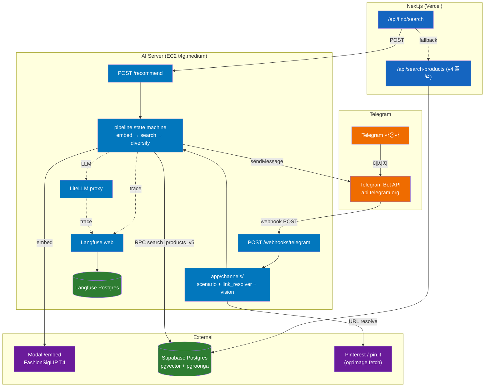

# portal-ai-server — 아키텍처

> portal.ai 서비스의 검색/리파인 담당 FastAPI 서버.
> 마지막 업데이트: 2026-05-04 (v0.2.0 — SPEC-MSG-001 Telegram messenger channel 추가).

## 한 줄 요약

`portal/app`(Next.js 모놀리스)에서 IG Vision 분석 끝난 단일 아이템을 받아, **Modal에서 이미지 임베딩 → Supabase `search_products_v5` RPC (dense+sparse+RRF) → 다양성 캡 → product 리스트 반환**.

**Telegram 채널**: Telegram 사용자가 패션 이미지·링크를 봇(`@kiko_fashion_ai_bot`)에 보내면 webhook → 시나리오 state machine → 동일 파이프라인 → 채널 응답 카드로 반환.

## 책임 분리

```
[Vercel / Next.js — portal/app]              [EC2 t4g.medium — portal/ai]              [Modal]
─────────────────────────────                 ────────────────────────────              ──────────
Apify 스크래핑 + R2 + DB                       AI 서버 (FastAPI)                          FashionSigLIP /embed
GPT-4o-mini Vision (LiteLLM 경유)              ├─ 검색 오케스트레이션                       (T4, scale-to-zero)
세션 / Auth / UI                               ├─ Telegram webhook + 채널 어댑터             단건 + 배치
검색 결과 렌더                                  LiteLLM proxy + Postgres                   Modal Volume 에 weights 캐시
v4 검색 (폴백 전용)                             Langfuse web + Postgres
```

**외부 채널 서비스**: Telegram Bot API (`https://api.telegram.org`) — Telegram 소유·운영, HTTPS webhook 방식. Pinterest(`pinterest.com` / `pin.it`) 서버사이드 fetch로 og:image 추출 (P0). Instagram P2 스텁.

**v5 인프라**: Supabase pgvector + pgroonga (`portal/app` 측 마이그레이션 027 + 030). Qdrant **사용 안 함**.

`enhance_query` LLM 리파인 step 은 백로그 — 현재 파이프라인은 직선 (embed → search → diversify).

## 시스템 토폴로지



## 디렉토리

```
app/
├── main.py                 # FastAPI 엔트리포인트 + lifespan (messenger adapter + session store + setWebhook)
├── api/
│   ├── health.py           # GET /health (liveness, no auth) / GET /health/ready (auth + messenger 상태)
│   ├── recommend.py        # POST /recommend (X-Internal-Token 인증)
│   └── webhooks/
│       └── telegram.py     # POST /webhooks/telegram (X-Telegram-Bot-Api-Secret-Token 인증)
├── channels/               # 채널 어댑터 레이어 (SPEC-MSG-001)
│   ├── schemas.py          # 채널 공통 Pydantic 스키마
│   ├── adapter.py          # MessengerAdapter ABC
│   ├── factory.py          # MESSENGER_BACKEND 기반 어댑터 팩토리
│   ├── link_resolver.py    # Pinterest / og:image URL 해석
│   ├── session.py          # 인메모리 세션 store (dict + asyncio.Lock, TTL)
│   ├── scenario.py         # 7-state 시나리오 state machine
│   ├── vision.py           # LiteLLM 경유 Vision 추출
│   └── telegram/
│       ├── adapter.py      # TelegramAdapter (sendMessage / sendPhoto / InlineKeyboard)
│       └── webhook.py      # Telegram Update 파싱
├── core/
│   ├── config.py           # Pydantic Settings (env) — 신규 메신저 키 포함
│   └── auth.py             # verify_internal_token dependency
├── pipeline/
│   ├── state.py            # PipelineState (state → state)
│   ├── embed.py            # Step 1: Modal /embed
│   ├── search.py           # Step 2: Supabase RPC (search_products_v5)
│   ├── diversify.py        # Step 3: 브랜드/플랫폼 캡 + tolerance
│   └── runner.py           # 파이프라인 조립 + @observe
├── providers/
│   ├── database.py         # SupabaseProvider (async, lifespan 워밍업)
│   ├── embedding.py        # EmbedProvider (Modal HTTP)
│   └── llm.py              # LLMProvider (LiteLLM HTTP)
├── observability/
│   └── langfuse.py         # @observe 데코레이터 (no-op fallback) + env 자동 주입 수정
└── models/
    ├── request.py          # RecommendRequest (alias 패턴 + image_url SSRF 가드)
    └── response.py         # RecommendResponse (serialization_alias)
```

## 검색 책임 경계

| 레이어 | 책임 |
|--------|------|
| Postgres (`search_products_v5` RPC) | dense (HNSW) + sparse (pgroonga BM25) + RRF → top-K 후보 반환 |
| Python (`pipeline/diversify.py`) | 다양성 캡 (브랜드 max 2 / 플랫폼 max 3), tolerance 적용, 최종 정렬 |

**근거**: DB는 인덱스를 잘 활용하는 것 (벡터/풀텍스트), Python은 비즈니스 로직 (변경 빈도 높은 다양성/리랭크/A/B).

## 관측성

| 도구 | 위치 | 비고 |
|------|------|------|
| Langfuse self-host | EC2 옆 컨테이너 + 별도 Postgres | trace SSOT |
| LiteLLM callback | `success_callback: ["langfuse"]` | 모든 LLM/embed 호출 자동 trace |
| AI 서버 코드 | `@observe(name=...)` 데코레이터 | step 단위 trace |

## 폴백 전략

| 시나리오 | 동작 |
|---------|------|
| AI 서버 5xx / timeout | Next.js가 v4 (`/api/search-products`) 호출로 폴백 |
| Modal /embed 실패 | AI 서버가 502 반환 → Next.js 폴백 트리거 (sparse-only 모드는 추후 고려) |
| Supabase RPC 실패 | AI 서버가 502 반환 → Next.js 폴백 트리거 |

## LangGraph 도입 시점 (보류)

confidence-fallback / multi-step retry / human-in-the-loop 등 분기가 실제로 도입될 때.
지금은 plain async + state → state 형태로 짜서 마이그레이션 비용 0 유지.

## 보안

| 항목 | 정책 |
|------|------|
| 인증 | `X-Internal-Token` (Next.js → AI 서버 shared secret). `/recommend`, `/health/ready` 보호 |
| Telegram webhook 인증 | `X-Telegram-Bot-Api-Secret-Token` 헤더 일치 확인. 불일치 시 401. 파싱 오류 시 200 (Telegram 재시도 방지) |
| `/health` (liveness) | 무인증, 부울만 노출 |
| SSRF | `RecommendRequest.image_url` 이 `ALLOWED_IMAGE_HOSTS` 화이트리스트 검증 (Pydantic) |
| CORS | `allow_origins=["*"]`, `allow_credentials=False` (stateless) |
| 에러 응답 | 내부 예외 메시지 노출 X — 고정 detail (`pipeline_failed`), 원인은 로그/Langfuse |

## 관련 문서

| 문서 | 내용 |
|------|------|
| [`PATTERNS.md`](PATTERNS.md) | 코드 컨벤션 (async, Pydantic alias, Provider 싱글톤, @observe, 인증) |
| [`features/pipeline.md`](features/pipeline.md) | state machine 상세 (각 step 입출력) |
| [`features/search-engine.md`](features/search-engine.md) | v5 RPC + RRF + 다양성 캡 |
| [`features/observability.md`](features/observability.md) | Langfuse 통합 + LiteLLM callback |
| [`infra/env.md`](infra/env.md) | 환경변수 매트릭스 |
| [`infra/deployment.md`](infra/deployment.md) | EC2 docker-compose + Modal 배포 |
| [`infra/cicd.md`](infra/cicd.md) | GitHub Actions + ECR + SSH 파이프라인 |
| `docs/plans/archive/` | 과거 Qdrant 기반 설계 (참고만) |
| `aws-infra/portal-ai-servers/portal-ai/` | EC2 docker-compose 본체 |
| `portal/app/supabase/migrations/030_search_products_v5.sql` | v5 RPC 마이그레이션 |

## 변경 이력

| 날짜 | 사건 |
|------|------|
| 2026-04-26 | **v0.1.0 — 모놀리스 분리 + v5 파이프라인 + CI/CD** (Phase A Qdrant 폐기, Modal/Langfuse/Supabase RPC, GHA + ECR 배포) |
| 2026-05-04 | **v0.2.0 — SPEC-MSG-001 Telegram messenger channel 추가** (app/channels/, POST /webhooks/telegram, 시나리오 state machine, Pinterest link resolver, lifespan 메신저 워밍업, /health/ready messenger 상태 노출) |
