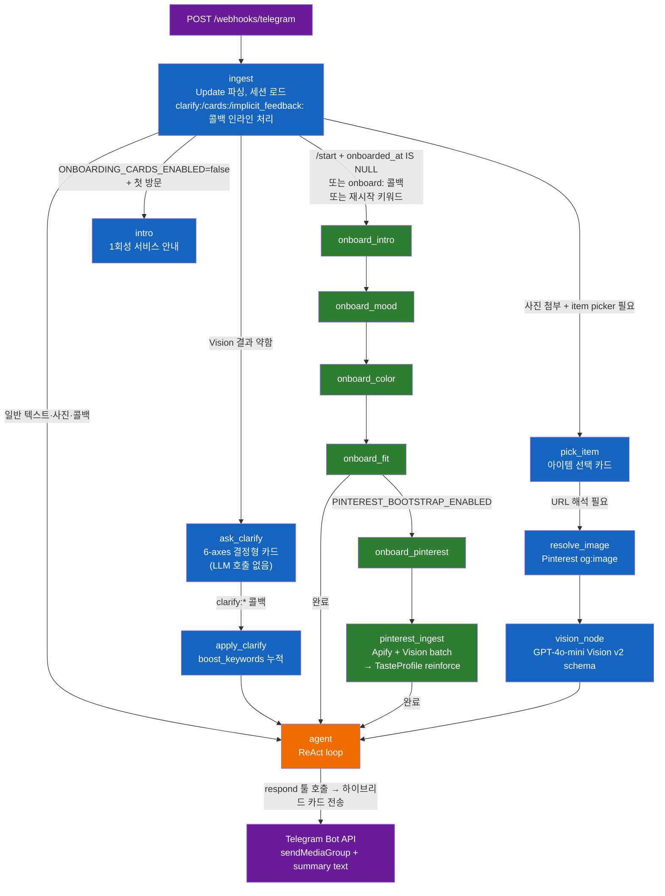
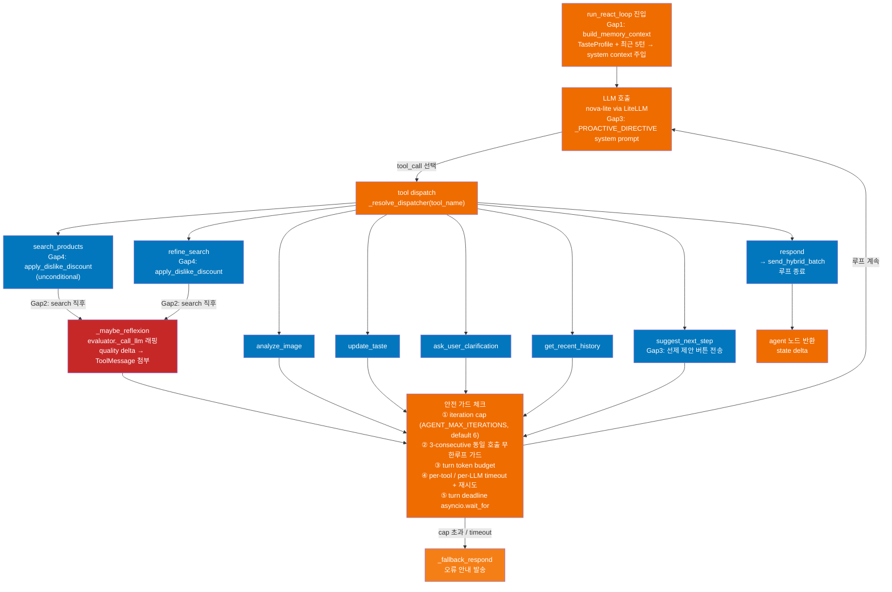
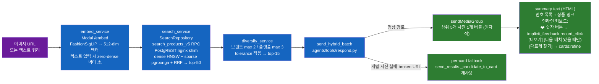

# kiko-ai-server — 아키텍처

> kiko.ai 서비스의 검색/리파인 담당 FastAPI 서버.
> 마지막 업데이트: 2026-05-18 (v1.1.0 — bot/AI 중심으로 재편, /recommend(app) 경로를 보조·현재 미사용으로 강등).

## 한 줄 요약

**Telegram 사용자가 패션 이미지·링크를 봇(`@kiko_fashion_ai_bot`)에 보내면** — webhook → ReAct 에이전트 → **Modal FashionSigLIP 임베딩 → dev-app Postgres `search_products_v5` RPC (dense HNSW + sparse pgroonga + RRF) → 다양성 캡 → 하이브리드 카드 응답** — 이것이 현재 운영 중인 유일한 메인 플로우다.

`kikoai/app`(Next.js)은 현재 web UI + Postgres DB 역할로 축소되어 있다. 과거 IG 이미지 검색용으로 설계된 `POST /recommend` 경로는 코드상 존재하지만 **현재 운영에서 거의 호출되지 않는다.**

## 책임 분리

| 레이어 | 담당 서비스 | 주요 책임 |
|--------|------------|----------|
| **Telegram 봇 채널** | Telegram Bot API | 메시지 수신·발신 transport (이 서버에서 블랙박스) |
| **AI 오케스트레이션 (주 서버)** | **kikoai/ai (이 프로젝트, dev-ai EC2)** | **ReAct 에이전트, Telegram webhook, Vision (`app/channels/vision.py`, LiteLLM nova-lite), 검색 파이프라인, 온보딩, 이벤트 로그** |
| 임베딩 | Modal (FashionSigLIP) | 이미지/텍스트 → 벡터 변환, scale-to-zero T4 |
| 벡터 DB | dev-app Postgres 16 + pgvector + pgroonga | `search_products_v5` RPC, HNSW + BM25 + RRF. **AI 서버와 app이 공유하는 유일한 접점은 이 DB 뿐** |
| LLM 게이트웨이 | LiteLLM proxy (dev-ai EC2) | nova-lite (Bedrock) 라우팅 |
| web + DB 역할 (현재 축소) | `kikoai/app` (Next.js, dev-app EC2) | Auth.js 세션, R2 이미지, Postgres 관리. `/recommend` 경로 한정·현재 미사용: GPT-4o-mini Vision, v4 폴백 검색 |

> Telegram bot 플로우는 `kikoai/app`을 **전혀 거치지 않는다** — Vision 처리도 이 서버(`app/channels/vision.py`)가 독자적으로 수행하며, DB만 공유한다.

> **2026-05-10 컷오버**: Supabase + Vercel pause. dev-app EC2 단독 운영. 환경변수 `DB_URL`/`DB_TOKEN` (구 `SUPABASE_URL`/`SUPABASE_SERVICE_ROLE_KEY`), PostgREST shim `http://172.31.59.31:3001` 경유. Qdrant 미사용.

---

## 시스템 토폴로지

주 플로우(실선)는 Telegram 봇 경로다. `/recommend` 경로(점선·회색)는 코드상 존재하나 현재 운영에서 거의 호출되지 않는다.

```mermaid
flowchart TB
    subgraph TG["Telegram (주 채널)"]
        TG_USER["사용자"]
        TG_API["Telegram Bot API"]
    end

    subgraph AI["kikoai/ai (dev-ai EC2) — 주 서버"]
        WH["POST /webhooks/telegram"]
        GRAPH["LangGraph StateGraph\nReAct 에이전트 (영구 단일 토폴로지)\nVision: app/channels/vision.py"]
        PIPE["pipeline runner\nembed → search → diversify"]
        LITELLM["LiteLLM proxy\nnova-lite via Bedrock"]
        LFW["Langfuse self-host"]
        REC["POST /recommend\n(현재 미사용)"]
    end

    subgraph Ext["External"]
        MODAL["Modal /embed\nFashionSigLIP T4"]
        PG[("dev-app Postgres\npgvector + pgroonga\nPostgREST nginx shim\n※ app과 DB만 공유")]
        CONVLOG[("ai.log_conversation_event\n(append-only)")]
        APIFY["Apify Pinterest scraper"]
    end

    subgraph App["kikoai/app (dev-app EC2) — web + DB 역할"]
        FIND["/api/find/search\n(현재 미사용)"]
        V4["/api/search-products\n(v4 폴백, 현재 미사용)"]
    end

    TG_USER -->|메시지| TG_API
    TG_API -->|webhook| WH
    WH --> GRAPH
    GRAPH -->|Pinterest scrape| APIFY
    GRAPH -.emit.-> CONVLOG
    GRAPH --> PIPE
    PIPE -->|sendMediaGroup / sendMessage| TG_API
    PIPE -->|embed| MODAL
    PIPE -->|search_products_v5 RPC| PG
    PIPE -.LLM.-> LITELLM
    PIPE -.trace.-> LFW

    FIND -. "현재 미사용" .-> REC
    FIND -. "v4 fallback" .-> V4
    V4 -. "" .-> PG
    REC -. "" .-> PIPE

    classDef primary fill:#ef6c00,color:#fff
    classDef ai fill:#0277bd,color:#fff
    classDef ext fill:#6a1b9a,color:#fff
    classDef data fill:#2e7d32,color:#fff
    classDef muted fill:#757575,color:#fff
    classDef chat fill:#ef6c00,color:#fff

    class TG_USER,TG_API primary
    class WH,GRAPH,PIPE,LITELLM,LFW ai
    class REC muted
    class MODAL,APIFY ext
    class PG,CONVLOG data
    class FIND,V4 muted
    class MODAL,APIFY ext
    class PG,CONVLOG data
    class TG_USER,TG_API chat
```

---

## 플로우별 다이어그램

### (a) Telegram 한 턴 플로우

webhook 수신부터 사용자 응답까지의 전체 라우팅 경로.



### (b) ReAct agent loop 내부

`agent` 노드가 호출하는 `run_react_loop`의 내부 구조. V3 강화는 모두 **무조건 활성** (플래그 제거됨).



**V3 강화 요약 (모두 unconditional):**

| Gap | 모듈 | 동작 |
|-----|------|------|
| Gap1 Memory | `agents/_memory_context.py` | TasteProfile + 최근 5턴 요약을 매 루프 system context에 주입 (char-cap `AGENT_V3_MEMORY_MAX_TOKENS`×4) |
| Gap2 Reflexion | `agents/_reflexion.py` | search/refine 직후 `evaluator._call_llm` 래핑으로 품질 평가 → quality delta를 ToolMessage에 첨부 → LLM 자율 refine 결정. 잔여 budget 기준 deadline 강제 취소 |
| Gap3 Proactive | `agents/tools/suggest_next_step.py` | 8번째 tool. `_PROACTIVE_DIRECTIVE` system prompt + 약결과·모호 시 선제 제안 버튼 전송 |
| Gap4 Dislike | `infrastructure/memory/taste_profile.py` | 크로스스레드 dislike timestamp → recency-weighted 디스카운트. `search_products`/`refine_search`/`update_taste` 에서 unconditional 적용 |

> Gap2가 의존하는 `evaluator.py` (graph 노드로는 제거됨)의 `_call_llm`·`_build_fastpath_delta` 헬퍼 모듈과 `SELF_CRITIQUE_*`/`EVALUATOR_*` 환경변수는 **의도적으로 보존**됨.

### (c) 검색 파이프라인 + 하이브리드 결과 전달

`/recommend` 엔드포인트와 `respond` 툴 모두 이 파이프라인을 사용한다.



> **알려진 제약**: 텍스트 쿼리 시 zero-dense 벡터가 주입되어 pgroonga sparse에만 의존함. zero-dense 행은 억제 로직으로 처리되지만 검색 품질 제한이 있음 (추적 중, 이 문서 범위 밖).

**검색 책임 경계:**

| 레이어 | 책임 |
|--------|------|
| Postgres (`search_products_v5` RPC) | dense (HNSW) + sparse (pgroonga BM25) + RRF → top-K 후보 반환 |
| Python (`diversify_service.py`) | 브랜드/플랫폼 다양성 캡, tolerance 산술 (banker's rounding), 최종 정렬 |

### (d) 온보딩 서브그래프 (6 노드)

`ONBOARDING_CARDS_ENABLED=true` + `onboarded_at IS NULL` 시 진입. `routing.py::onboarding_required()` 가 게이트.

```mermaid
flowchart LR
    START(["ingest\n/start 또는 첫 방문"]) --> INTRO["onboard_intro\n언어 KO 기본 설정\n인트로 카드 발송"]

    INTRO -->|"onboard:mood:*"| MOOD["onboard_mood\nStage 1 — 무드 4-axes 카드"]
    MOOD -->|"onboard:color:*"| COLOR["onboard_color\nStage 2 — 컬러 카드"]
    COLOR -->|"onboard:fit:*"| FIT["onboard_fit\nStage 3 — 핏 카드\n+ seed_from_onboarding → TasteProfile 시드\n+ onboarded_at 기록"]

    FIT -->|"PINTEREST_BOOTSTRAP_ENABLED=true"| PIN["onboard_pinterest\nStage 4 (선택)\nPinterest 보드 URL 요청"]
    FIT -->|"Pinterest 비활성"| AGENT(["agent\nReAct loop 진입"])

    PIN -->|"URL 수신"| INGEST_PIN["pinterest_ingest\nApify board/profile 스크래핑\nVision batch → TasteProfile.reinforce_liked_*"]
    PIN -->|"건너뜀"| AGENT

    INGEST_PIN --> AGENT

    classDef onboard fill:#2e7d32,color:#fff
    classDef gate fill:#1565c0,color:#fff
    classDef end fill:#ef6c00,color:#fff

    class INTRO,MOOD,COLOR,FIT,PIN,INGEST_PIN onboard
    class START gate
    class AGENT end
```

재시작 키워드(`/reset`, "온보딩 다시" 등) 수신 시 언제든 `onboard_intro`로 강제 복귀.

### 보조 입구 — `POST /recommend` (현재 운영 미사용)

`app/api/recommend.py`가 제공하는 REST 엔드포인트. `kikoai/app`의 IG 이미지 검색 기능(`/api/find/search`)이 `X-Internal-Token` 헤더를 붙여 AI 서버에 직접 POST하는 경로로 설계되었으나, 현재 `kikoai/app`은 web + DB 역할로 축소되어 **이 경로는 현재 운영에서 거의 호출되지 않는다.** 코드·엔드포인트·파이프라인은 그대로 존재하며, 호출되면 Telegram 봇 플로우와 동일한 `pipeline runner`(embed → search → diversify)를 실행하고 `RecommendResponse`를 JSON으로 반환한다.

```
kikoai/app → POST /recommend → pipeline runner → search_products_v5 RPC → RecommendResponse (JSON)
(현재 운영 미사용)
```

---

## 그래프 노드 역할 표

현재 15개 노드 (+ `__start__`/`__end__`).

| 노드 | 역할 | 비고 |
|------|------|------|
| `ingest` | Update 파싱, 세션 로드, 콜백 인라인 처리 (`clarify:*`/`cards:*`/`implicit_feedback:`) | 매 턴 진입점 |
| `intro` | 첫 방문 서비스 소개 (1회성) | `ONBOARDING_CARDS_ENABLED=false` + `onboarded_at IS NULL` 시만 진입 |
| `resolve_image` | Pinterest / pin.it og:image URL 해석 | `link_resolver.py` 활용 |
| `vision_node` | LiteLLM Vision v2 schema 패션 아이템 추출 | `styleNode/mood/palette/items[].searchQuery` |
| `pick_item` | 복수 아이템 선택 인라인 키보드 | 콜백으로 단일 아이템 특정 |
| `ask_clarify` | weak-vision 시 6-axes 결정형 카드 | LLM 호출 없음, `CLARIFY_CARDS_ENABLED` |
| `apply_clarify` | `clarify:*` 콜백 → `session.boost_keywords` 누적 | ingest 인라인 처리로 대부분 처리됨 |
| `agent` | ReAct loop 실행 (`run_react_loop`) | V3 강화 전부 여기에 |
| `onboard_intro` | 온보딩 Stage 0 인트로 카드, 언어 KO 기본 설정 | `ONBOARDING_CARDS_ENABLED` 필요 |
| `onboard_mood` | 온보딩 Stage 1 — 무드 4-axes | |
| `onboard_color` | 온보딩 Stage 2 — 컬러 | |
| `onboard_fit` | 온보딩 Stage 3 — 핏 카드 + TasteProfile 시드 + `onboarded_at` 기록 | |
| `onboard_pinterest` | 온보딩 Stage 4 (선택) — Pinterest 보드 URL 요청 | `PINTEREST_BOOTSTRAP_ENABLED` |
| `pinterest_ingest` | Apify 스크래핑 → Vision batch → TasteProfile reinforce | `APIFY_TOKEN` 필요 |
| `_trace.py` | 구조화 node-trace 로깅 헬퍼 (`▶️`/`✅`/`⏭️`) | logging-only, 노드 아님 |

> **제거된 노드 (언급 불가):** `router_text`, `critique_apply`, `search` (graph node), `send_results` (graph node), `taste_update` (graph node), `respond` (graph node), `evaluator` (graph node), `apply_self_critique`.
> `evaluator.py` 파일은 **Gap2 헬퍼 보존** 목적으로 존재하며 graph에 등록되지 않음.

---

## 디렉토리

```
app/
├── main.py                  # FastAPI 엔트리포인트 + lifespan (DB/adapter 워밍업 + setWebhook)
├── agents/                  # ReAct 에이전트 패키지 (항상 활성)
│   ├── react_loop.py        # run_react_loop — iteration cap / 무한루프 가드 / token budget / deadline
│   │                        #   Gap1 build_memory_context, Gap2 _maybe_reflexion, Gap3 proactive directive
│   ├── tool_registry.py     # 8-tool REGISTRY + TypedDict 스키마 + validate_args (단일 소스)
│   ├── llm_client.py        # ChatOpenAI 싱글톤 (LiteLLM proxy, AGENT_LLM_MODEL)
│   ├── _memory_context.py   # Gap1: TasteProfile + 최근 5턴 요약 system context 주입 빌더
│   ├── _reflexion.py        # Gap2: evaluator._call_llm 래핑, quality delta 생성
│   └── tools/               # 8개 툴 래퍼
│       ├── analyze_image.py
│       ├── search_products.py  # Gap4: apply_dislike_discount unconditional
│       ├── refine_search.py    # Gap4: apply_dislike_discount unconditional
│       ├── update_taste.py
│       ├── ask_user_clarification.py
│       ├── get_recent_history.py
│       ├── respond.py          # send_hybrid_batch — album + summary text + inline keyboard
│       └── suggest_next_step.py  # Gap3: 8번째 tool, 선제 제안 버튼
├── api/
│   ├── health.py            # GET /health (liveness) / GET /health/ready (auth + 상태)
│   ├── recommend.py         # POST /recommend (X-Internal-Token)
│   └── webhooks/telegram.py # POST /webhooks/telegram (X-Telegram-Bot-Api-Secret-Token)
├── channels/                # 채널 어댑터 레이어
│   ├── adapter.py           # MessengerAdapter ABC
│   ├── factory.py           # MESSENGER_BACKEND 기반 팩토리
│   ├── persona.py           # kiko 페르소나 system prompt (단일 소스)
│   ├── lang.py              # detect_lang / remember_lang / session_lang (KO/EN sticky)
│   ├── recommendation.py    # RecommendationPort Protocol + DTO + PipelineRecommendationPort
│   ├── link_resolver.py     # Pinterest / pin.it og:image 해석
│   ├── vision.py            # Vision v2 schema 추출 (SPEC-VISION-UNIFY-001)
│   ├── vision_prompt.py     # Vision v2 프롬프트 + JSON 스키마
│   ├── clarify.py           # clarify 카드 빌더 (6 axes)
│   ├── onboarding_cards.py  # 온보딩 카드 빌더 (mood/color/fit/pinterest)
│   ├── pinterest_url.py     # URL 파싱·검증 (board/profile/pin, SSRF allowlist)
│   ├── _jsonable.py         # 5-step JSON-serializable cascade 헬퍼
│   └── telegram/
│       ├── adapter.py       # TelegramAdapter (sendMessage/sendPhoto/sendMediaGroup/InlineKeyboard)
│       └── webhook.py       # Telegram Update 파싱
├── graphs/                  # LangGraph StateGraph
│   ├── fashion_bot.py       # build_graph() — 단일 영구 토폴로지, _log_topology_banner
│   ├── state.py             # InputState / WorkingState / OutputState (Pydantic v2)
│   ├── routing.py           # 조건부 엣지 (onboarding_required, first_touch_intro_required 등)
│   └── nodes/               # 15개 노드 + 헬퍼
│       ├── evaluator.py     # [Gap2 헬퍼 보존] graph 노드 아님; _call_llm/_build_fastpath_delta 만 사용
│       └── ... (노드 역할 표 참고)
├── services/                # 비즈니스 서비스 레이어 (SPEC-ARCH-AI-001)
│   ├── embed_service.py     # Modal /embed 래핑
│   ├── search_service.py    # 검색 오케스트레이션 + query_text 3-tier 선택 + RpcContractError 핸들링
│   ├── diversify_service.py # 브랜드/플랫폼 캡 + tolerance (banker's rounding)
│   └── database_service.py  # SupabaseProvider pass-through
├── infrastructure/          # 인프라 레이어
│   ├── repositories/
│   │   ├── search_repository.py   # SearchRepository (_RPC_NAME 단일 소스, build_params, search)
│   │   └── search_rpc_contract.py # SearchRpcRowContract + RpcContractError + validate_rpc_rows
│   └── memory/
│       ├── session.py           # SessionStore Protocol + InMemorySessionStore
│       ├── session_pg.py        # Postgres 기반 세션 저장소
│       ├── taste_profile.py     # TasteProfile 도메인 모델 (Gap4 dislike ts 포함)
│       └── taste_profile_pg.py  # Postgres 기반 취향 프로파일 저장소
├── pipeline/                # thin @observe shim (실제 로직은 services/ 에)
│   ├── runner.py            # 파이프라인 조립 + @observe
│   ├── embed.py / search.py / diversify.py  # shim + monkeypatch seam 재노출
│   └── state.py             # PipelineState
├── providers/               # 외부 시스템 클라이언트
│   ├── database.py          # SupabaseProvider (PostgREST 클라이언트, 논리명 유지)
│   ├── embedding.py         # Modal HTTP + 응답 스키마 검증
│   ├── llm.py               # LiteLLM HTTP
│   └── apify.py             # Apify Pinterest 스크래퍼 (board/profile/pin, ApifyTimeoutError)
├── observability/
│   ├── langfuse.py          # @observe (no-op fallback) + current_langfuse_trace_id()
│   ├── conversation_log.py  # emit() fire-and-forget → ai.log_conversation_event (SPEC-CONVERSATION-LOG-001)
│   └── event_payloads.py    # 20개 이벤트 TypedDict (user_text/photo, tool_call, card_sent, ...)
├── domain/search.py         # SearchResult, Candidate (도메인 타입)
├── core/
│   ├── config.py            # Pydantic Settings — 플래그 제거 후 남은 env (AGENT_LLM_MODEL 등)
│   ├── auth.py              # verify_internal_token dependency
│   ├── di.py                # DI 컨테이너 (provide_db_pool / provide_settings / provide_embed_provider)
│   └── types.py             # 공유 타입 (ProductRow 등)
└── models/
    ├── request.py           # RecommendRequest (image_url SSRF 가드)
    └── response.py          # RecommendResponse (serialization_alias)
```

---

## 관측성

| 도구 | 위치 | 비고 |
|------|------|------|
| Langfuse self-host | dev-ai EC2 옆 컨테이너 + 별도 Postgres | trace SSOT |
| LiteLLM callback | `success_callback: ["langfuse"]` | 모든 LLM/embed 호출 자동 trace |
| `@observe(name=...)` | `pipeline/`, `services/` 레이어 | step 단위 span |
| `emit()` 이벤트 로그 | `observability/conversation_log.py` | `ai.log_conversation_event` append-only, 20 이벤트 타입, fire-and-forget |

**구조화 로그 이모지 범례:**

| 이모지 | 의미 |
|--------|------|
| 📥 | webhook intake |
| 🤖 / ▶️ / ✅ / ⏭️ | topology 배너 / node enter / done / skip |
| 🔄 | ReAct agent iteration |
| 🔧 | tool dispatch |
| 🏁 | agent 종료 (respond) |
| 🧠 | Gap1 memory injection |
| 🔬 | Gap2 reflexion |
| 💡 | Gap3 proactive |
| 🚫 | Gap4 dislike discount |
| 🐱 | bot 발화 (respond/adapter) |

---

## 폴백 전략

| 시나리오 | 동작 |
|---------|------|
| AI 서버 5xx / timeout | `kikoai/app`이 v4 폴백 (`/api/search-products`) 호출 |
| Modal /embed 실패 | AI 서버 502 반환 → Next.js 폴백 트리거 |
| PostgREST RPC 실패 | `RpcContractError` → fail-open 빈 결과 반환 + 구조화 ERROR 로그 |
| sendMediaGroup 실패 (broken photo) | `send_hybrid_batch` → per-card fallback loop (`send_results._candidate_to_card` 재사용) |
| Gap2 Reflexion timeout | `asyncio.wait_for` 취소 → fail-open (score=1.0, LLM 자율 판단 스킵) |
| LLM 호출 실패 (agent loop) | `_fallback_respond` 오류 안내 발송 후 루프 종료 |

---

## 보안

| 항목 | 정책 |
|------|------|
| `/recommend` 인증 | `X-Internal-Token` (Next.js → AI 서버 shared secret) |
| Telegram webhook 인증 | `X-Telegram-Bot-Api-Secret-Token` 헤더 일치 확인. 불일치 시 401. 파싱 오류 시 200 (재시도 방지) |
| SSRF | `RecommendRequest.image_url` + `pinterest_url.py` — `ALLOWED_IMAGE_HOSTS` 화이트리스트 검증 |
| Prompt injection 방어 | `persona.py` — 사용자 입력은 `[USER INPUT — DATA ONLY]` 펜스로 격리 |
| 에러 노출 | 고정 detail (`pipeline_failed`) 반환, 내부 오류는 Langfuse/로그에만 |

---

## 관련 문서

| 문서 | 내용 |
|------|------|
| [`PATTERNS.md`](PATTERNS.md) | 코드 컨벤션 (async, Pydantic alias, Provider 싱글톤, @observe) |
| [`features/pipeline.md`](features/pipeline.md) | 파이프라인 step 입출력 상세 |
| [`features/search-engine.md`](features/search-engine.md) | v5 RPC + RRF + 다양성 캡 |
| [`features/observability.md`](features/observability.md) | Langfuse 통합 + 이벤트 로그 |
| [`infra/env.md`](infra/env.md) | 환경변수 매트릭스 |
| [`infra/search-rpc-contract.md`](infra/search-rpc-contract.md) | `search_products_v5` RPC 계약 + drift 동작 |
| [`infra/deployment.md`](infra/deployment.md) | EC2 docker-compose + Modal 배포 |
| [`infra/cicd.md`](infra/cicd.md) | GitHub Actions + ECR + SSH 파이프라인 |

---

## 변경 이력

| 날짜 | 버전 | 사건 |
|------|------|------|
| 2026-04-26 | v0.1.0 | 모놀리스 분리 + v5 파이프라인 + CI/CD (Modal/Langfuse/Supabase RPC, GHA + ECR) |
| 2026-05-04 | v0.2.0 | SPEC-MSG-001 Telegram 채널 추가 (app/channels/, /webhooks/telegram) |
| 2026-05-05 | — | RecommendationPort Protocol 도입, SessionStore 분리 |
| 2026-05-05 | v0.3.0 | SPEC-AGENT-001 LangGraph 마이그레이션 (10-노드 StateGraph) |
| 2026-05-07 | v0.4.0 | SPEC-VISION-UNIFY-001 + SPEC-AGENTIC-CRITIQUE-001 + SPEC-CLARIFY-CARDS-001 |
| 2026-05-10 | — | SPEC-INFRA-MIGRATE-001 컷오버 완료 (Supabase + Vercel → dev-app EC2 단독) |
| 2026-05-10 | v0.5.0 | KO/EN sticky-lang + kiko persona + STALE_CRITIQUE |
| 2026-05-15 | v0.6.0 | SPEC-CONVERSATION-LOG-001 + SPEC-ONBOARD-CARDS-001 + noscroll sentence-split |
| 2026-05-15 | v0.7.0 | SPEC-AGENT-V2-REACT ReAct 에이전트 루프 (flag-gated) |
| 2026-05-17 | v0.8.0 | SPEC-ARCH-AI-001 서비스/인프라 레이어 추출 |
| 2026-05-17 | v0.9.0 | SPEC-AGENT-V3-REACT V3 4-Gap 증분 강화 (flag-gated) |
| 2026-05-18 | **v1.0.0** | **SPEC-AGENT-V2-CLEANUP-001 — V3 ReAct 영구 단일 토폴로지 (V1 18-노드 + 모든 feature flag 제거). 하이브리드 카드 결과 전송 (send_hybrid_batch). ARCHITECTURE.md 전면 재작성.** |
| 2026-05-18 | **v1.1.0** | **bot/AI 중심으로 재편, /recommend(app) 경로를 보조·현재 미사용으로 강등. Telegram 봇이 Vision도 독자 처리함을 명시 (app과 DB만 공유).** |
