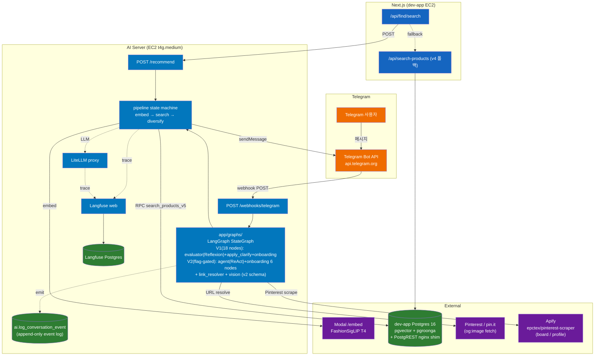

# kiko-ai-server — 아키텍처

> kiko.ai 서비스의 검색/리파인 담당 FastAPI 서버.
> 마지막 업데이트: 2026-05-17 (v0.8.0 — SPEC-ARCH-AI-001 서비스/인프라 레이어 추출 + RPC 계약 검증).

## 한 줄 요약

`kikoai/app`(Next.js 모놀리스)에서 IG Vision 분석 끝난 단일 아이템을 받아, **Modal에서 이미지 임베딩 → dev-app Postgres `search_products_v5` RPC (PostgREST nginx shim 경유, dense+sparse+RRF) → 다양성 캡 → product 리스트 반환**.

**Telegram 채널**: Telegram 사용자가 패션 이미지·링크를 봇(`@kiko_fashion_ai_bot`)에 보내면 webhook → **LangGraph StateGraph** (`app/graphs/`, V1: 18 노드 / V2(flag-gated): `agent` 노드 + 온보딩 6 노드 — `search → evaluator` Reflexion 루프는 V2에서 `agent` ReAct loop으로 대체, SPEC-AGENT-V2-REACT) → 동일 파이프라인 → 채널 응답 카드로 반환. 모든 webhook turn 에서 `emit()` 로 `ai.log_conversation_event` append-only 기록 (SPEC-CONVERSATION-LOG-001).

## 책임 분리

```
[dev-app EC2 — kikoai/app + Postgres]         [dev-ai EC2 — kikoai/ai]                  [Modal]
─────────────────────────────────────         ────────────────────────────              ──────────
Next.js standalone (Auth.js v5)               AI 서버 (FastAPI)                          FashionSigLIP /embed
Apify 스크래핑 + R2 + Postgres                  ├─ 검색 오케스트레이션                       (T4, scale-to-zero)
GPT-4o-mini Vision (LiteLLM 경유)              ├─ Telegram webhook + 채널 어댑터             단건 + 배치
검색 결과 렌더                                  LiteLLM proxy + Postgres                   Modal Volume 에 weights 캐시
v4 검색 (폴백 전용)                             Langfuse web + Postgres
Postgres 16 + pgvector + pgroonga
+ PostgREST + nginx shim (자체호스팅)
```

**외부 채널 서비스**: Telegram Bot API (`https://api.telegram.org`) — Telegram 소유·운영, HTTPS webhook 방식. Pinterest(`pinterest.com` / `pin.it`) 서버사이드 fetch로 og:image 추출 (P0). Instagram P2 스텁. **Apify** (`api.apify.com` — `epctex/pinterest-scraper` actor): 온보딩 Stage 4 Pinterest 보드/프로파일 핀 스크래핑 (SPEC-ONBOARD-CARDS-001, 비동기 httpx, `APIFY_TOKEN` 필요).

**v5 인프라**: dev-app Postgres 16 + pgvector + pgroonga (마이그레이션 027 + 030 적용). PostgREST + nginx shim 으로 `DB_URL` 호환 라우팅. SPEC-INFRA-MIGRATE-001 P6 이후 Supabase.com 미사용. Qdrant **사용 안 함**.

> **2026-05-10 컷오버**: Supabase + Vercel pause. dev-app EC2 단독 운영. env 변수는 `DB_URL`/`DB_TOKEN` 으로 리네임 완료 (구 `SUPABASE_URL`/`SUPABASE_SERVICE_ROLE_KEY`), nginx PostgREST shim (`http://172.31.59.31:3001/rest/v1/...`) 으로 라우팅.

`enhance_query` LLM 리파인 step 은 백로그 — 현재 파이프라인은 직선 (embed → search → diversify).

## 시스템 토폴로지



## 디렉토리

```
app/
├── main.py                 # FastAPI 엔트리포인트 + lifespan (messenger adapter + session store + setWebhook)
├── agents/                 # ReAct 에이전트 루프 + 툴 레지스트리 (SPEC-AGENT-V2-REACT, AGENT_V2_REACT_ENABLED=true 시 활성)
│   ├── react_loop.py       # ReAct loop 엔진 (iteration cap / infinite-loop guard / token budget / timeout / tool_call emit)
│   ├── tool_registry.py    # 7-tool REGISTRY + TypedDict args/result schema + validate_args
│   ├── llm_client.py       # ChatOpenAI 싱글톤 (bind_tools, LiteLLM proxy). AGENT_LLM_MODEL 미설정 시 fail-closed
│   └── tools/              # 툴 래퍼 7개: analyze_image / search_products / refine_search / update_taste / ask_user_clarification / get_recent_history / respond
├── api/
│   ├── health.py           # GET /health (liveness, no auth) / GET /health/ready (auth + messenger 상태)
│   ├── recommend.py        # POST /recommend (X-Internal-Token 인증)
│   └── webhooks/
│       └── telegram.py     # POST /webhooks/telegram (X-Telegram-Bot-Api-Secret-Token 인증)
├── channels/               # 채널 어댑터 레이어 (SPEC-MSG-001)
│   ├── schemas.py          # 채널 공통 Pydantic 스키마
│   ├── adapter.py          # MessengerAdapter ABC
│   ├── factory.py          # MESSENGER_BACKEND 기반 어댑터 팩토리
│   ├── link_resolver.py    # Pinterest / og:image URL 해석
│   ├── recommendation.py   # RecommendationPort Protocol + ChannelRecommendationRequest/Result DTO + PipelineRecommendationPort 구현
│   ├── lang.py             # detect_lang / remember_lang / session_lang — KO/EN sticky 언어 감지
│   ├── session.py          # (구 channels/session.py — SPEC-ARCH-AI-001 이전) SessionStore Protocol + InMemorySessionStore
│   ├── vision.py           # LiteLLM 경유 Vision 추출 (v2 schema, SPEC-VISION-UNIFY-001)
│   ├── vision_prompt.py    # Vision v2 프롬프트 + JSON 스키마 (kikoai/app analyze.ts 동치)
│   ├── clarify.py          # clarify 카드 빌더 (6 axes, SPEC-CLARIFY-CARDS-001)
│   ├── clarify_values.py   # clarify axis 옵션 + 한글 라벨
│   ├── onboarding_cards.py # 온보딩 카드 빌더 (4 axes: mood/color/fit/pinterest, SPEC-ONBOARD-CARDS-001)
│   ├── onboarding_values.py # 온보딩 axis 옵션 + KO/EN 라벨 + keywords_to_boost
│   ├── pinterest_url.py    # Pinterest URL 파싱·검증 (board/profile/pin 모드, SSRF allowlist)
│   ├── _jsonable.py        # 5-step JSON-serializable cascade 헬퍼 (공용)
│   └── telegram/
│       ├── adapter.py      # TelegramAdapter (sendMessage / sendPhoto / InlineKeyboard / edit_inline_keyboard)
│       └── webhook.py      # Telegram Update 파싱
├── graphs/                 # LangGraph StateGraph (SPEC-AGENT-001)
│   ├── fashion_bot.py      # 그래프 빌드 + 모듈 수준 컴파일 캐시 + build_metadata
│   ├── state.py            # InputState / WorkingState / OutputState (Pydantic v2)
│   ├── routing.py          # 6개 조건부 엣지 함수
│   └── nodes/
│       ├── ingest.py       # Update 파싱 + 세션 로드 (V2: clarify:* callback inline 처리 포함)
│       ├── resolve_image.py # Pinterest / pin.it og:image 해석
│       ├── vision.py       # LiteLLM Vision 패션 아이템 추출
│       ├── pick_item.py    # 인라인 키보드 picker (콜백 처리)
│       ├── ask_clarify.py  # weak-vision 시 결정형 카드 (6 axes, no LLM, SPEC-CLARIFY-CARDS-001)
│       ├── apply_clarify.py # clarify:* 콜백 → session.boost_keywords 누적 [DEPRECATED V2, 롤백 보존]
│       ├── agent.py        # ReAct agent 노드 — run_react_loop 래핑 (SPEC-AGENT-V2-REACT, V2 전용)
│       ├── intro.py        # 첫 방문 서비스 소개 — ONBOARDING_CARDS_ENABLED=false 시 신규 사용자 1회성 안내 (SPEC-AGENT-V2-REACT, V2 전용)
│       ├── critique_apply.py # Routing-LLM + critique refinement [DEPRECATED V2, 롤백 보존]
│       ├── search.py       # RecommendationPort → 파이프라인 호출
│       ├── evaluator.py    # 결과 평가 + 빈 결과 fast-path / LLM critique 재시도 (SPEC-AGENTIC-CRITIQUE-001) [DEPRECATED V2, 롤백 보존]
│       ├── send_results.py # 검색 결과 카드 전송
│       ├── taste_update.py # 장기 취향 프로파일 업데이트 [DEPRECATED V2, 롤백 보존]
│       ├── respond.py      # 자연어 reply (ChatOpenAI, RESPONSE_MODEL) + sentence-split (RESPONSE_SPLIT_ENABLED) [DEPRECATED V2, 롤백 보존]
│       ├── onboard_intro.py # 온보딩 인트로 — /start + onboarded_at IS NULL 진입점 (SPEC-ONBOARD-CARDS-001)
│       ├── onboard_mood.py  # Stage 1: 무드 카드
│       ├── onboard_color.py # Stage 2: 컬러 카드
│       ├── onboard_fit.py   # Stage 3: 핏 카드 + seed_from_onboarding
│       ├── onboard_pinterest.py # Stage 4 (선택): Pinterest 보드 URL 요청
│       ├── pinterest_ingest.py  # Pinterest 핀 스크래핑 → Vision batch → TasteProfile reinforce
│       ├── _onboard_helpers.py  # 온보딩 내부 헬퍼 (seed, 완료 메시지, stage 전환)
│       ├── _onboard_stage.py    # 온보딩 stage enum + 전환 테이블
│       └── _pinterest_helpers.py # 핀 Vision batch + reinforce 헬퍼
├── core/
│   ├── config.py           # Pydantic Settings (env) — 신규 메신저 키 포함
│   ├── auth.py             # verify_internal_token dependency
│   ├── di.py               # DI 컨테이너 — provide_db_pool / provide_settings / provide_embed_provider (SPEC-ARCH-AI-001 REQ-AI-003)
│   └── types.py            # 공유 타입 (SPEC-ARCH-AI-001)
├── domain/
│   └── search.py           # 도메인 타입 — SearchResult, Candidate (SPEC-ARCH-AI-001)
├── services/               # 비즈니스 서비스 레이어 (SPEC-ARCH-AI-001 PR1)
│   ├── embed_service.py    # Modal /embed 래핑
│   ├── search_service.py   # 검색 오케스트레이션 + query_text 선택 + RpcContractError 핸들링 (REQ-AI-006)
│   ├── diversify_service.py # 브랜드/플랫폼 캡 + tolerance (banker's rounding)
│   └── database_service.py # SupabaseProvider pass-through
├── infrastructure/         # 인프라 레이어 (SPEC-ARCH-AI-001 PR2-5)
│   ├── repositories/
│   │   ├── search_repository.py   # SearchRepository — _RPC_NAME 단일 소스 + build_params + search (REQ-AI-002)
│   │   └── search_rpc_contract.py # SearchRpcRowContract Pydantic + RpcContractError + validate_rpc_rows (REQ-AI-006)
│   └── memory/
│       ├── session.py          # (구 channels/session.py) SessionStore Protocol + InMemorySessionStore
│       ├── session_pg.py       # (구 channels/session_pg.py) Postgres 기반 세션 저장소
│       ├── taste_profile.py    # (구 channels/taste_profile.py) TasteProfile 도메인 모델
│       └── taste_profile_pg.py # (구 channels/taste_profile_pg.py) Postgres 기반 취향 프로파일 저장소
├── pipeline/               # thin @observe shim 레이어 (SPEC-ARCH-AI-001 — 실제 로직은 services/로 이전)
│   ├── state.py            # PipelineState (state → state)
│   ├── embed.py            # shim → embed_service + EmbedProvider 재노출 (monkeypatch seam)
│   ├── search.py           # shim → search_service + SupabaseProvider 재노출 (monkeypatch seam)
│   ├── diversify.py        # shim → diversify_service + _tolerance_to_target_count 재노출
│   └── runner.py           # 파이프라인 조립 + @observe
├── providers/
│   ├── database.py         # SupabaseProvider — PostgREST 클라이언트 (논리명 유지, async, lifespan 워밍업)
│   ├── db_pool.py          # psycopg3 AsyncConnectionPool 초기화 + di.py 위임 어댑터 (SPEC-ARCH-AI-001 REQ-AI-003)
│   ├── embedding.py        # EmbedProvider (Modal HTTP)
│   ├── llm.py              # LLMProvider (LiteLLM HTTP)
│   └── apify.py            # ApifyProvider — Pinterest 스크래퍼 (httpx, board/profile/pin 3-mode, ApifyTimeoutError)
├── observability/
│   ├── langfuse.py         # @observe 데코레이터 (no-op fallback) + env 자동 주입 + current_langfuse_trace_id()
│   ├── conversation_log.py # 대화 이벤트 로거 — log_event / emit / _truncate (SPEC-CONVERSATION-LOG-001)
│   └── event_payloads.py   # 20개 이벤트 TypedDict 정의 (SPEC-CONVERSATION-LOG-001 + tool_call — SPEC-AGENT-V2-REACT)
└── models/
    ├── request.py          # RecommendRequest (alias 패턴 + image_url SSRF 가드)
    └── response.py         # RecommendResponse (serialization_alias)
```

## 검색 책임 경계

| 레이어 | 책임 |
|--------|------|
| Postgres (`search_products_v5` RPC) | dense (HNSW) + sparse (pgroonga BM25) + RRF → top-K 후보 반환 |
| Python (`services/diversify_service.py`, thin shim `pipeline/diversify.py`) | 다양성 캡 (브랜드 max 2 / 플랫폼 max 3), tolerance 적용, 최종 정렬 |

**근거**: DB는 인덱스를 잘 활용하는 것 (벡터/풀텍스트), Python은 비즈니스 로직 (변경 빈도 높은 다양성/리랭크/A/B).

## 관측성

| 도구 | 위치 | 비고 |
|------|------|------|
| Langfuse self-host | EC2 옆 컨테이너 + 별도 Postgres | trace SSOT |
| LiteLLM callback | `success_callback: ["langfuse"]` | 모든 LLM/embed 호출 자동 trace |
| AI 서버 코드 | `@observe(name=...)` 데코레이터 | step 단위 trace |

## 폴백 전략

| 시나리오 | 동작 |
|---------|------|
| AI 서버 5xx / timeout | Next.js가 v4 (`/api/search-products`) 호출로 폴백 |
| Modal /embed 실패 | AI 서버가 502 반환 → Next.js 폴백 트리거 (sparse-only 모드는 추후 고려) |
| PostgREST RPC 실패 | AI 서버가 502 반환 → Next.js 폴백 트리거 |

## LangGraph (SPEC-AGENT-001 — 도입됨)

Telegram webhook 흐름은 `app/graphs/fashion_bot.py` 의 `StateGraph` 로 구현.
`webhook → graph.ainvoke(InputState(...), config={"callbacks": [build_callback_handler(...)]})` 단일 호출 (REQ-AGENT-008).

`build_graph()` 가 `AGENT_V2_REACT_ENABLED` + `AGENT_LLM_MODEL` 로 토폴로지를 분기:

**V1 토폴로지 (기본, AGENT_V2_REACT_ENABLED=false)**:
- `search → evaluator → send_results` Reflexion 루프 (SPEC-AGENTIC-CRITIQUE-001) — 빈 결과 시 필터 drop fast-path / LLM 평가 점수 < threshold 시 `CritiqueDelta` 생성 후 search 재진입 (max 2회 + 4 안전 가드: iteration cap / stagnation / score regression / 30s wall-clock)
- `ask_clarify → apply_clarify` 결정형 카드 (SPEC-CLARIFY-CARDS-001) — weak-vision 시 6 axes 인라인 키보드, callback 수신 시 `session.boost_keywords` 누적 (self-critique fast-path 통과)
- **`STALE_CRITIQUE` flow**: `respond` 노드에 추가. `crit:*` 콜백이 만료된 카드에 대해 들어올 때 `critique_apply` 가 delta 없이 반환 → `respond` 가 STALE_CRITIQUE flow 로 분류해 "오래된 카드" 안내 메시지 발송. 단, `crit:click:` 콜백은 예외 — END 로 직접 라우팅 (SPEC-IMPLICIT-FB-001).

**V2 토폴로지 (flag-gated, AGENT_V2_REACT_ENABLED=true + AGENT_LLM_MODEL 설정 시, 운영 default off)**:
- 온보딩 6 노드(`onboard_intro/mood/color/fit/pinterest` + `pinterest_ingest`) 보존 — 동일 분기 로직.
- 신규 `intro` 노드: `ONBOARDING_CARDS_ENABLED=false` + `onboarded_at IS NULL` 시 1회성 서비스 안내 발송 → `onboarded_at` 기록 → 턴 종료. 2번째 메시지부터 `agent` 정상 진입.
- Post-onboarding 텍스트/사진/콜백은 모두 `agent` 단일 노드 → `run_react_loop` (SPEC-AGENT-V2-REACT, `app/agents/`). **ReAct agent LLM: Bedrock nova-lite (`AGENT_LLM_MODEL`) via LiteLLM** (`drop_params: true` 적용, `tool_choice` 필드 제거로 Bedrock 호환).
- ReAct loop: LLM이 7개 도구(`analyze_image` / `search_products` / `refine_search` / `update_taste` / `ask_user_clarification` / `get_recent_history` / `respond`) 중 순차 선택 → `respond` 호출 시 루프 종료. 안전 가드: iteration cap (`AGENT_MAX_ITERATIONS`) / 3-consecutive 동일 호출 무한루프 가드 / token budget (`AGENT_TURN_TOKEN_BUDGET`) / per-LLM timeout + transient retry (`AGENT_LLM_MAX_RETRIES`) / per-tool timeout (`AGENT_TOOL_TIMEOUT_S`) + transient retry (`AGENT_TOOL_MAX_RETRIES`) / terminal respond 전용 타임아웃 (`AGENT_RESPOND_TIMEOUT_S`, 재시도 없음).
- Deprecated (V2에서 미등록, V1 rollback용 보존): `critique_apply`, `evaluator`, `respond`(graph node), `taste_update`, `send_results`, `channels/router.py`.
- `ingest` 노드: V2 활성 시 `clarify:*` 콜백을 inline 처리 → `session.boost_keywords` 누적 후 `agent` 로 라우팅.

**공통 분기**:
- **온보딩 카드 분기** (SPEC-ONBOARD-CARDS-001): `/start` + `sess.onboarded_at IS NULL` → `onboard_intro → onboard_mood → onboard_color → onboard_fit → (PINTEREST_BOOTSTRAP_ENABLED) → onboard_pinterest → pinterest_ingest` 3+1 stage 카드 온보딩. 완료 시 `seed_from_onboarding()` 로 TasteProfile 시드 → `onboarded_at` 기록. Pinterest stage 에서 Apify 스크래핑 + Vision batch → `TasteProfile.reinforce_liked_*` 머지.
- **KO/EN sticky 언어**: `ingest` 노드가 `app/channels/lang.remember_lang()` 으로 `Session.lang` 갱신 → 이후 버튼 탭도 동일 언어 유지.
- **이벤트 소싱 (SPEC-CONVERSATION-LOG-001)**: 모든 노드 + webhook intake 에서 `emit(event_type, payload)` 호출 → fire-and-forget `asyncio.create_task` → `ai.log_conversation_event` 테이블 INSERT. `MEMORY_BACKEND_IS_POSTGRES=False` 시 silent skip. PG outage 시 stderr JSON fallback (tag: `CONV_LOG_FALLBACK`). V2에서 `tool_call` 이벤트(20번째 타입) 추가 — react_loop 내 매 tool dispatch마다 emit.
- **sentence-split 발화 (noscroll benchmark)**: `RESPONSE_SPLIT_ENABLED=true` 시 V1 `respond` 노드가 LLM 출력을 문장 단위로 분할. V2에서는 `agents/tools/respond.py` 가 동일 역할.

파이프라인(`/recommend`)은 여전히 plain async + state → state 형태 유지 — 마이그레이션 없음.

## 보안

| 항목 | 정책 |
|------|------|
| 인증 | `X-Internal-Token` (Next.js → AI 서버 shared secret). `/recommend`, `/health/ready` 보호 |
| Telegram webhook 인증 | `X-Telegram-Bot-Api-Secret-Token` 헤더 일치 확인. 불일치 시 401. 파싱 오류 시 200 (Telegram 재시도 방지) |
| `/health` (liveness) | 무인증, 부울만 노출 |
| SSRF | `RecommendRequest.image_url` 이 `ALLOWED_IMAGE_HOSTS` 화이트리스트 검증 (Pydantic) |
| CORS | `allow_origins=["*"]`, `allow_credentials=False` (stateless) |
| 에러 응답 | 내부 예외 메시지 노출 X — 고정 detail (`pipeline_failed`), 원인은 로그/Langfuse |

## 관련 문서

| 문서 | 내용 |
|------|------|
| [`PATTERNS.md`](PATTERNS.md) | 코드 컨벤션 (async, Pydantic alias, Provider 싱글톤, @observe, 인증) |
| [`features/pipeline.md`](features/pipeline.md) | state machine 상세 (각 step 입출력) |
| [`features/search-engine.md`](features/search-engine.md) | v5 RPC + RRF + 다양성 캡 |
| [`features/observability.md`](features/observability.md) | Langfuse 통합 + LiteLLM callback |
| [`infra/env.md`](infra/env.md) | 환경변수 매트릭스 |
| [`infra/search-rpc-contract.md`](infra/search-rpc-contract.md) | `search_products_v5` RPC 입출력 계약 + 드리프트 동작 (SPEC-ARCH-AI-001 REQ-AI-006) |
| [`infra/deployment.md`](infra/deployment.md) | EC2 docker-compose + Modal 배포 |
| [`infra/cicd.md`](infra/cicd.md) | GitHub Actions + ECR + SSH 파이프라인 |
| `docs/plans/archive/` | 과거 Qdrant 기반 설계 (참고만) |
| `aws-infra/kiko-ai-servers/portal-ai/` | EC2 docker-compose 본체 |
| `kikoai/app/supabase/migrations/030_search_products_v5.sql` | v5 RPC 마이그레이션 (디렉토리명 유지 — Supabase CLI 시절 잔재, dev-app Postgres 에 적용됨) |

## 변경 이력

| 날짜 | 사건 |
|------|------|
| 2026-04-26 | **v0.1.0 — 모놀리스 분리 + v5 파이프라인 + CI/CD** (Phase A Qdrant 폐기, Modal/Langfuse/Supabase RPC 시절, GHA + ECR 배포) |
| 2026-05-10 | **SPEC-INFRA-MIGRATE-001 컷오버 완료** — Supabase + Vercel pause. dev-app EC2 단독 운영 (Postgres 16 + pgvector + pgroonga + PostgREST nginx shim). kikoai/ai 코드 변경 0줄 (env 논리명 유지) |
| 2026-05-04 | **v0.2.0 — SPEC-MSG-001 Telegram messenger channel 추가** (app/channels/, POST /webhooks/telegram, 시나리오 state machine, Pinterest link resolver, lifespan 메신저 워밍업, /health/ready messenger 상태 노출) |
| 2026-05-05 | **refactor/channels-decoupling** — `RecommendationPort` Protocol 도입으로 채널-파이프라인 결합도 분리 (scenario → RecommendationPort → PipelineRecommendationPort → runner). `SessionStore` Protocol + 주입 지점 분리. scenario explicit SM 재정리 (Trigger enum + TRANSITIONS dict). |
| 2026-05-05 | **v0.3.0 — SPEC-AGENT-001 LangGraph 마이그레이션** (`app/channels/scenario.py` 제거 → `app/graphs/` 10-노드 StateGraph. `respond`/`ask_clarify` 신규 노드 + `langchain-openai` 의존성. `build_callback_handler` Langfuse 통합 — langfuse v2+langchain 비호환으로 현재 None 폴백, 후속 SPEC-OBSV-V3-001 에서 복구 예정.) |
| 2026-05-10 | **v0.5.0 — KO/EN sticky-lang + kiko persona + STALE_CRITIQUE** (`app/channels/lang.py` 신규. `Session.lang` sticky 필드. `ingest` 노드 매 텍스트 턴 언어 갱신. `respond`/`send_results`/`pick_item`/`ask_clarify`/`critique_apply` KO/EN 분기. `respond` "kiko" 페르소나 system prompt + prompt injection 방어. `_Flow.STALE_CRITIQUE` 신규 flow. 구조화 로그 이모지 범례 도입. webhook privacy: user_id 해시, from_username 미로깅, 텍스트 80자 캡.) |
| 2026-05-15 | **v0.6.0 — SPEC-CONVERSATION-LOG-001 + SPEC-ONBOARD-CARDS-001 + noscroll sentence-split** (이벤트 소싱: `ai.log_conversation_event` append-only 테이블 (migration 0003), 19 이벤트 TypedDict, `emit()` fire-and-forget, PG failsoft stderr fallback. 온보딩 카드: 6 신규 노드 (onboard_intro/mood/color/fit/pinterest + pinterest_ingest), `app/providers/apify.py` (Apify httpx wrapper, ApifyTimeoutError), `app/channels/onboarding_cards/values/pinterest_url.py` + `_jsonable.py`, migration 0004 (`user_session` + `onboarded_at` 컬럼). noscroll P0: `RESPONSE_SPLIT_ENABLED` 문장 분할 발화. 그래프 노드 수 12 → 18.) |
| 2026-05-07 | **v0.4.0 — SPEC-VISION-UNIFY-001 + SPEC-AGENTIC-CRITIQUE-001 + SPEC-CLARIFY-CARDS-001** (Vision v2 풍부 스키마 — `kikoai/app` `analyze.ts` 동치 (styleNode/sensitivityTags/mood/palette/style/items[].subcategory/fit/colorFamily/searchQuery). `evaluator` 노드 + Reflexion 루프 (빈 결과 fast-path / LLM critique 재시도 max 2회 + 4 안전 가드). `ask_clarify` 텍스트 → 결정형 카드 (6 axes, no LLM) + `apply_clarify` 노드 — clarify-derived keywords 가 `session.boost_keywords` 로 sticky 누적. flags: `VISION_SCHEMA_V2` / `SELF_CRITIQUE_ENABLED` / `CLARIFY_CARDS_ENABLED` (모두 default true). 263 tests pass.) |
| 2026-05-17 | **v0.8.0 — SPEC-ARCH-AI-001 서비스/인프라 레이어 추출** (`app/services/` 4개 서비스, `app/infrastructure/repositories/` SearchRepository + RPC 계약 검증, `app/infrastructure/memory/` 세션/취향 프로파일 이전, `app/core/di.py` DI 컨테이너, `app/domain/` 도메인 타입. `app/pipeline/` thin shim 으로 리팩토링. 외부 행동 byte-identical (REQ-AI-007), characterization net 46+5=51 통과. `RpcContractError` 신규 — 드리프트 시 구조화 ERROR 로그 + fail-open 빈 결과 (REQ-AI-006). `docs/infra/search-rpc-contract.md` 신규.) |
| 2026-05-15 | **v0.7.0 — SPEC-AGENT-V2-REACT ReAct 에이전트 루프 (flag-gated, default off)** (`app/agents/` 신규 패키지: `react_loop.py` / `tool_registry.py` / `llm_client.py` / `tools/` 7개 래퍼. `app/graphs/nodes/agent.py` 신규. `WorkingState` +3 필드 (`agent_iterations`, `tool_call_history`, `agent_status`). `fashion_bot.py` — `AGENT_V2_REACT_ENABLED` + `AGENT_LLM_MODEL` 양쪽 설정 시 V2 토폴로지 선택. 6 신규 env vars (`AGENT_V2_REACT_ENABLED` / `AGENT_MAX_ITERATIONS` / `AGENT_TURN_TOKEN_BUDGET` / `AGENT_TOOL_TIMEOUT_S` / `AGENT_LLM_MODEL` / `AGENT_LLM_TIMEOUT_S`). 20번째 이벤트 타입 `tool_call` 추가. `/health/ready` +2 필드 (`agent_v2_react_enabled` / `agent_llm_model_configured`). 5 deprecated 모듈 (rollback 보존): `critique_apply` / `evaluator` / `respond` / `taste_update` graph nodes + `channels/router.py`.) |
