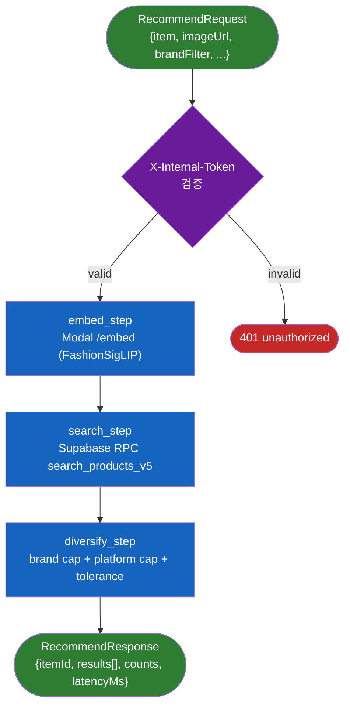

# 추천 파이프라인

> `POST /recommend` 의 단일 진입점. Phase A(Qdrant) 폐기 후 v5 (Modal embed + Supabase RPC) 로 재구현.

## 데이터 흐름



## state machine

전 step 이 동일 시그니처 — `(state: PipelineState) -> PipelineState`.

`app/pipeline/state.py`:

```python
@dataclass
class PipelineState:
    request: RecommendRequest

    # 중간 산출물
    embedding: list[float] | None = None
    raw_candidates: list[dict[str, Any]] = field(default_factory=list)
    final_candidates: list[dict[str, Any]] = field(default_factory=list)

    # 측정
    counts: dict[str, int] = field(default_factory=dict)
    latency_ms: dict[str, int] = field(default_factory=dict)
    _step_starts: dict[str, float] = field(default_factory=dict)

    def start(self, step: str) -> None: ...
    def end(self, step: str) -> None: ...
```

## 각 step

### 1. `embed_step` — `app/pipeline/embed.py`

```python
state.embedding = await EmbedProvider.embed_image_url(state.request.image_url)
```

| 항목 | 값 |
|------|---|
| 호출 | Modal `POST /embed` |
| 모델 | `Marqo/marqo-fashionSigLIP` |
| 출력 | 768-dim L2-normalized vector |
| 단건 latency (warm) | ~100~300ms (인퍼런스) + 네트워크 |
| 단건 latency (cold, scale-to-zero) | ~10~17초 |
| 실패 시 | `pipeline_failed` 502 → Next.js 가 v4 폴백 |

### 2. `search_step` — `app/pipeline/search.py`

```python
rows = await SupabaseProvider.rpc("search_products_v5", {
    "query_embedding": _embedding_to_pgvector(state.embedding),
    "query_text": req.item.search_query_ko or req.item.search_query,
    "brand_filter": req.brand_filter,
    "gender_filter": [req.gender] if req.gender else None,
    "subcategory_filter": req.item.subcategory,
    "price_min": ...,
    "price_max": ...,
    "k": 50, "rrf_k": 60,
})
```

| 항목 | 값 |
|------|---|
| RPC | `search_products_v5` (`portal/app/supabase/migrations/030_search_products_v5.sql`) |
| 알고리즘 | dense (HNSW pgvector) + sparse (pgroonga BM25) + RRF |
| top-K | 50 |
| 응답 | `dense_rank`, `sparse_rank`, `dense_score`, `sparse_score`, `score` (RRF) |

상세: [`search-engine.md`](search-engine.md).

### 3. `diversify_step` — `app/pipeline/diversify.py`

```python
target = req.final_limit or _tolerance_to_target_count(req.tolerance)
brand_cap = settings.SEARCH_BRAND_CAP * 3 if req.brand_filter else settings.SEARCH_BRAND_CAP
platform_cap = settings.SEARCH_PLATFORM_CAP

# brand/platform 카운터로 buckets 채우면서 상위 N 선별
```

| 정책 | 값 (기본) |
|------|----------|
| 브랜드 캡 | `SEARCH_BRAND_CAP=2` (brand_filter 있으면 ×3 완화) |
| 플랫폼 캡 | `SEARCH_PLATFORM_CAP=3` |
| target count by tolerance | `0.0 → 10`, `0.5 → 15`, `1.0 → 20` (linear) |

`final_limit` 가 명시되면 tolerance 무시.

## 측정

`PipelineState.counts` / `latency_ms` 가 응답에 포함:

```json
{
  "itemId": "item-1",
  "results": [...],
  "counts": {"raw": 50, "after_diversify": 15, "final": 15},
  "latencyMs": {"embed": 1234, "search": 89, "diversify": 2}
}
```

Langfuse trace 의 `recommend_pipeline` span 하위에 `pipeline.embed`/`pipeline.search`/`pipeline.diversify` 가 자동 표시 — `@observe` 데코레이터.

## 향후 LangGraph 도입 시점

지금은 plain async 직선 파이프라인. 다음 분기가 실제 도입될 때 LangGraph 로 마이그레이션:

| 시그널 | 트리거 |
|-------|-------|
| confidence-fallback | 검색 confidence 낮으면 LLM 으로 쿼리 재작성 → 재검색 |
| Vision picker 자동화 | items 검출 애매 → LLM 으로 most prominent 선택 |
| strongMatches 0건 → general 자동 폴백 |
| A/B 분기 | search v5a vs v5b 비교 |

각 step 함수는 그대로 노드로 wrap 만 하면 됨 → 마이그레이션 비용 ~0.

## 에러 / 폴백 매트릭스

| 단계 | 실패 케이스 | 동작 |
|------|------------|------|
| 인증 | `X-Internal-Token` 불일치 | 401 |
| `image_url` 검증 | 화이트리스트 외 호스트 | 422 (Pydantic) |
| Modal /embed | 5xx / timeout / 스키마 mismatch | 502 (`pipeline_failed`) — Next.js 가 v4 폴백 트리거 |
| Supabase RPC | exception | 502 — 동일 |
| diversify | exception (이론상 없음) | 502 |

> **note**: sparse-only 폴백은 추후 검토 (현재 dense+sparse 결합 결과를 기준으로 검색 품질 튜닝 진행 중).
