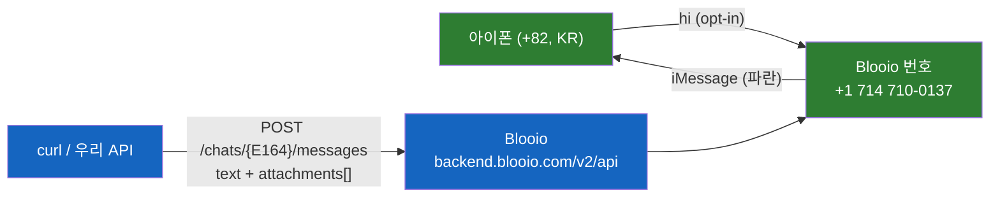
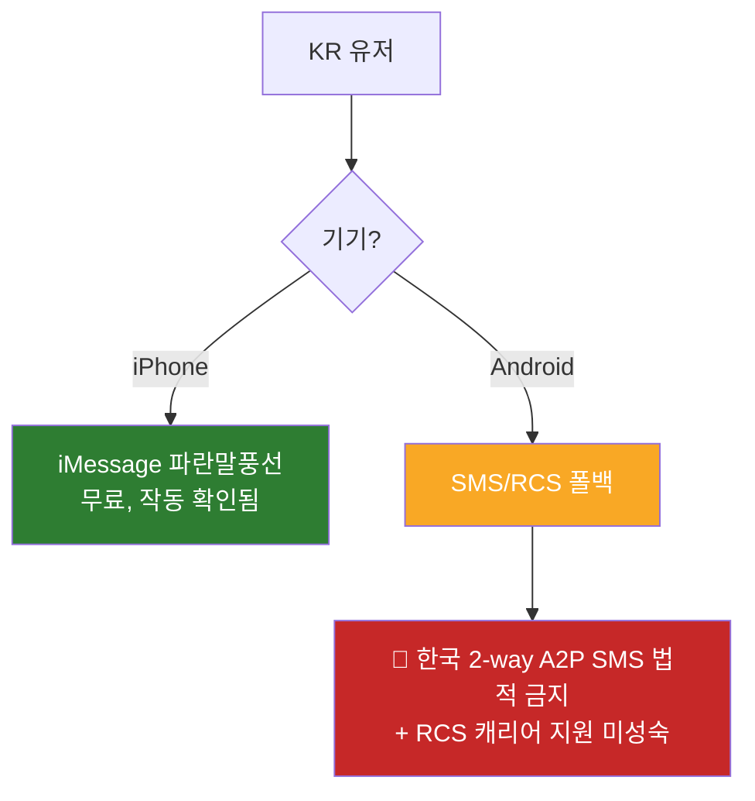
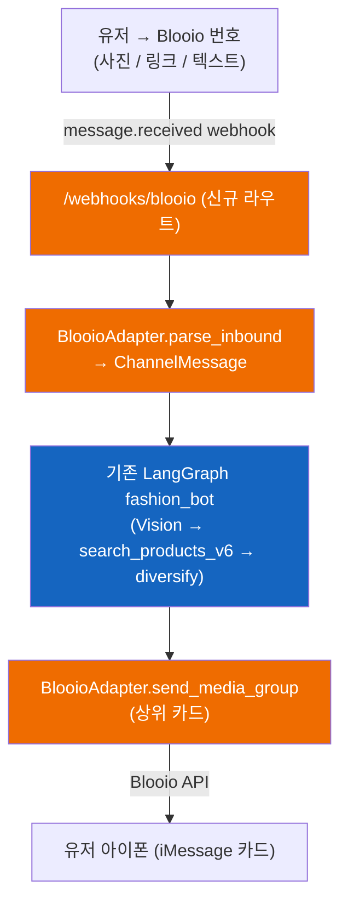

# iMessage 채널 확장 — 리서치 & PoC

> **목적**: 기존 Telegram 봇에 더해 `kikoai/ai`에 **iMessage 채널**을 동일한 `MessengerAdapter` 구조로 추가할 수 있는지 평가. 제공자 지형, 동작하는 PoC, 비용, 한국 특화 제약, 통합 계획을 정리한다.
>
> **작성일**: 2026-05-22
> **상태**: ✅ PoC 검증 완료 (Blooio). 코드 미작성. 유료 결제 미진행.
> **결론**: US 번호로 한국 아이폰에 iMessage 발송 작동(텍스트 + 이미지, 데이터로 무료). PoC는 LoopMessage/Sendblue/Linq 대신 **Blooio** 채택. 프로덕션은 유료(제공자 구독료만, 추가 인프라 비용 없음).
> **검증 기반**: Blooio API + 대시보드 실측 PoC(2026-05-22). 제공자 가격/API는 공식 문서 기준(하단 Sources).

---

## TL;DR — 핵심 6가지

1. **iMessage엔 공개 봇 API가 없다.** Apple은 프로그램으로 iMessage 송수신을 허용하지 않는다. "파란 말풍선"은 서드파티 Mac-팜 대행 제공자(Blooio, LoopMessage, Sendblue, Linq) 또는 자체호스팅 BlueBubbles가 필요.
2. **Twilio ≠ iMessage.** Twilio는 SMS / RCS / WhatsApp / voice만 — iMessage 불가. 온라인의 "Twilio + iMessage"는 Twilio(SMS) + 별도 iMessage 제공자 조합이거나, Twilio RCS(리치하지만 초록 채널, 한국 약함).
3. **우리 코드는 ~80% 준비됨.** `MessengerAdapter` ABC + factory(`_ACCEPTED`에 이미 `sendblue`/`bluebubbles` 스텁) + Port 패턴 → 그래프/검색/Vision 파이프라인은 채널 중립. iMessage = 어댑터 1개 + webhook 라우트 1개.
4. **Blooio로 PoC 성공.** US 트라이얼 번호 `+1 (714) 710-0137` → 한국 아이폰(`+82…`): 텍스트 + 실제 상품 이미지가 **iMessage로, 100% 도달**, 무료, 등록 마찰 0으로 ~5분 만에.
5. **LoopMessage는 더 싸지만 막혔다.** **DUNS 사업자번호 + Apple ID 등록** 요구; 개편된 대시보드가 샌드박스를 숨김; 끝내 발송 성공 못 함. ~$75/mo vs Blooio $289/mo — 가격 차이도 진짜, 마찰도 진짜.
6. **한국은 iMessage엔 유리, SMS엔 적대적.** US 번호 → KR 아이폰 = 파란 iMessage(무료, 작동). KR 안드로이드 → 초록 SMS 폴백인데 **한국은 2-way A2P SMS를 법적으로 금지**. 패션/젊은층은 아이폰 비중 높음 → iMessage-first가 핏.

---

## 섹션 1 — iMessage가 Telegram과 다른 점

| | Telegram | iMessage |
|---|---|---|
| 공개 봇 API | ✅ 무료, 즉시(`@BotFather`) | ❌ 없음 — Apple 폐쇄망 |
| 프로그램 발송 방법 | Bot API over HTTPS | 서드파티 Mac-팜 대행 or 자체호스팅 BlueBubbles |
| 콜드 발송(모르는 사람 먼저) | 가능 | ❌ opt-in / 2-way only (스팸 방지) |
| 인라인 버튼 | ✅ InlineKeyboard | ❌ 불가 (Apple Messages for Business만 리치 UI) |
| 비용 | 무료 | 유료 구독(제공자) |

**Twilio 정리**(반복된 질문): Twilio = AI 에이전트용 SMS/RCS/WhatsApp/voice 인프라. iMessage **불가**. "Twilio로 iMessage"로 기억하는 건 (a) Twilio 번호를 Sendblue로 포팅, 또는 (b) **Twilio RCS** — iOS 18.2부터 아이폰 도달 + 버튼/카드 리치하지만, 파란 iMessage가 아니고 한국 캐리어 RCS 지원이 미성숙.

---

## 섹션 2 — 제공자 지형 (2026)

| 제공자 | 진입/프로덕션 가격 | 무료 테스트 | 가입 마찰 | 메모 |
|---|---|---|---|---|
| **Blooio** ⭐ (채택) | Shared $39 · Commercial Shared $89 · **Commercial Dedicated $289/mo** (무제한, 전용번호) | ✅ **20건 총량, 카드 불필요** | 🟢 **없음** (번호 즉시 발급) | 플랫 요금, RCS/SMS 폴백, 공개 문서, 깔끔한 REST+webhook |
| **LoopMessage** | Light $59.99 (300/일) · Regular $99.99 (1000/일) + 번호 $15 + SMS폴백 $15 | 샌드박스(5명) | 🔴 **DUNS + Apple ID 등록** | 가장 싼 프로덕션(~$75/mo)이나 일일 cap + 무거운 온보딩. **우리 PoC를 막음.** |
| **Sendblue** | AI Agent $100/mo/line(inbound-first); 풀 아웃바운드 = Enterprise(custom) | 샌드박스(10명) | 🟡 중간 | 기능 최다(SOC2/HIPAA, FaceTime, 그룹) |
| **Linq (Linq Blue)** | 세일즈 전용(~$167/mo 추정) + **셋업 $500+** | ❌ 없음 | 🔴 세일즈 콜 | **SOC2 Type II**, **Poke가 사용**. 엔터프라이즈급. |
| **BlueBubbles** | 무료 소프트웨어(자체호스팅) | 해당없음 | 🔴 높음(Mac + Apple ID 운영) | 오픈소스; 과거 `kikoai` 시도가 Apple-ID 발급 막힘(SPEC-MSG-001 v0.2.0) |

애드온(Blooio): 커스텀 지역번호 +$75 1회성. 메시지당/A2P/캐리어 요금 없음(iMessage는 인터넷).

---

## 섹션 3 — 실제 프로덕트 사례

| 프로덕트 | 채널 | iMessage 레이어 | 우리한테 의미 |
|---|---|---|---|
| **Poke** (2026, Spark Capital + General Catalyst) | **iMessage + SMS + Telegram** | **Linq** | ⭐ **kiko와 채널 구성 동일** (Telegram 운영 중 + iMessage 추가). 멀티채널-오버-텍스트 전략 검증. |
| **noscroll** | SMS + Telegram (기기 허용 시 iMessage) | 서드파티 iMessage 제공자 | 사용자가 계속 언급한 벤치마크. **패션이 아니라 SMS 뉴스다이제스트 봇**(`conversational-shopping-agents.md`와 일치). `+1 (415)` 번호가 KR 아이폰에 파란 iMessage 도달 — US번호→KR-iMessage 작동의 라이브 증거. |
| Sidekicks / iChatWithGPT / Mei / AgentMessage | iMessage + SMS | 각종 | "텍스트로 쓰는 AI" 카테고리가 2026 현재 성숙했음을 확인. |

---

## 섹션 4 — PoC 결과 (2026-05-22)

### Blooio — ✅ 성공

- 조직 `hchsa77`; 트라이얼 번호 **`+1 (714) 710-0137`** 즉시 발급, "Fully warmed".
- 인증: `Authorization: Bearer <api_key>`. 발신: `POST https://backend.blooio.com/v2/api/chats/{E164-urlencoded}/messages`, body `{from_number, text, attachments[], use_typing_indicator, effect}`.
- **검증됨**: 텍스트 + **이미지 2장**(샘플 + 실제 kiko Shopify 상품 사진)이 한국 아이폰에 **iMessage로, Status = Delivered, 100% delivery rate** 도달.
- 트라이얼은 `"Message sent via Blooio free trial"` 꼬리표 부착(유료 시 제거).
- **발견한 함정**:
  - 번호를 **API 키에 link** 해야 함(Numbers 탭 → Assigned), 안 하면 503 `"No active devices"`.
  - 쉘이 JSON URL 안 `?`/`=`를 `\?`/`\=`로 이스케이프 → JSON invalid escape → 400 `"Missing message content"`. 작은따옴표 `-d` 안에선 이스케이프 금지.
  - 무료 트라이얼 = **20건 총량(평생)**, 하루 단위 아님. "작동 확인"엔 충분, 반복 개발엔 부족.

### LoopMessage — ❌ 막힘

- 서류상 더 싸지만: 발송 전 **DUNS 번호 + Apple ID 등록** 필요.
- 개편된 대시보드가 문서상의 "Sandbox" 사이드바를 제거; 조직 opt-in URL은 pool에 sender 필요(pool 비어있음 → `"can't find any available sender for opt-in"`). 끝내 발송 성공 못 함.
- `kikoai`가 과거 BlueBubbles iMessage에서 피벗한 것과 일관(SPEC-MSG-001 v0.2.0: "Apple ID provisioning blocked").

---

## 섹션 5 — 비용 분석 (프로덕션)

**추가 인프라 비용 = $0.** AI 서버(dev-ai EC2), Modal 임베딩, LiteLLM, Langfuse, 검색 파이프라인은 이미 Telegram용으로 가동 중. iMessage는 webhook 라우트 + 제공자 구독료만 추가. Telegram은 계속 무료.

| 경로 | 월 | 1회성 | 단서 |
|---|---|---|---|
| **LoopMessage** (Light + 번호) | **~$75** (≈ ₩10만) | DUNS/Apple ID 등록(시간) | 하루 300명 cap; 우리를 막은 경로 |
| **Blooio** Commercial Dedicated | **$289** (≈ ₩40만) | +$75 커스텀 지역번호(선택) | 무제한, 마찰 0 |
| Sendblue | ~$100+ | — | 아웃바운드 스케일은 Enterprise |
| Linq | ~$167 | **셋업 $500+** | 세일즈 전용; Poke의 선택 |

> 공유 플랜($39/$89)은 회전 번호 풀 → 봇엔 부적합(유저가 안정적 번호 저장 불가). 봇은 **전용** 번호 필요.

**결론**: iMessage 채널 운영 = 제공자 청구서 1개, 전용번호 1개당 월 **~$75(LoopMessage, 등록 뚫으면) ~ $289(Blooio, 마찰 없음)**.

---

## 섹션 6 — 한국 특화 발견

- **US (+1) 번호 → KR 아이폰 = 파란 iMessage, 무료, 확인됨**(PoC + noscroll). 이들 제공자는 한국(+82) iMessage 번호를 제공하지 않음; 외국 번호가 표준이고 작동함.
- KR **안드로이드** 유저는 초록 SMS 폴백 — 하지만 한국은 **2-way A2P SMS 금지**(일방향만) + 발신자ID 등록 + 08:00–21:00 KST 시간 제한. 그래서 2-way 봇에겐 SMS 폴백 경로가 사실상 사망.
- 완화: 우리 타겟(패션/젊은층)은 **아이폰 비중이 높아** iMessage-first가 합리적. 한국 전체 도달은 KakaoTalk이 진짜 채널(여기선 범위 밖).
- iMessage는 본질적으로 **opt-in / 2-way** — kiko의 inbound-first UX(유저가 사진 들고 옴)에 맞고 noscroll/Poke와 동일. 콜드 발송 없음.

---

## 섹션 7 — 통합 계획 (만들 때)

**필요한 것:**
1. **`BlooioAdapter`** — `MessengerAdapter` 구현(`parse_inbound` / `send_text` / `send_card` / `send_media_group`). `app/channels/factory.py`의 `_ACCEPTED`에 `blooio` 등록(`sendblue`/`bluebubbles` 옆 슬롯 패턴 이미 존재).
2. **`/webhooks/blooio`** FastAPI 라우트 + Blooio 대시보드에 URL 등록(공개 URL 필요 — dev-ai EC2).
3. **Env**: `MESSENGER_BACKEND=blooio`, `BLOOIO_API_KEY`, `BLOOIO_FROM_NUMBER`, webhook secret.
4. **UX 조정**(중요): iMessage엔 **인라인 버튼 없음** → ❤️ / 더보기 / 다르게찾기 콜백 키보드를 **텍스트/숫자 답장**으로 재설계(예: "1번 좋아요", "더"). 채널 무관 작업.
5. **워밍업**: *새* 전용 번호는 1~2주 워밍업 필요(트라이얼 714는 선워밍됨).

**Blooio API → `MessengerAdapter` 매핑**(깔끔한 핏):

| ABC 메서드 | Blooio |
|---|---|
| `parse_inbound` | `message.received` webhook(`sender`/`text`/`attachments`/`protocol`) |
| `send_text` | `text`(문자열 **또는 배열** → `RESPONSE_SPLIT` 문장분할에 매핑) |
| `send_card` / `send_media_group` | `attachments[]`(한 메시지에 이미지 URL 배열 → 상위5장 카드 버블) |
| `send_chat_action` | `use_typing_indicator` |
| (진단) | `protocol` 필드 = imessage/sms/rcs → 어떤 채널로 갔는지 파악 |

---

## 섹션 8 — 제약 & 리스크

| # | 제약 | 영향 |
|---|---|---|
| C1 | iMessage 인라인 버튼 없음 | 콜백 UX(좋아요/더보기/리파인) → 텍스트/숫자 답장 재설계 |
| C2 | opt-in / 2-way only | inbound-first kiko엔 OK; 콜드 마케팅 푸시 불가 |
| C3 | KR 안드로이드 → SMS 폴백, 한국 2-way A2P SMS 금지 | iMessage는 아이폰만 도달; KR 안드로이드 유저는 이 채널로 도달 불가 |
| C4 | 신규 전용번호 워밍업 1~2주 | 런칭 타이밍 고려 |
| C5 | 제공자 ToS / Apple 밴 리스크(Mac-팜 대행) | 모든 서드파티 iMessage 공통; 제공자가 관리 |
| C6 | 반복 비용($75~$289/mo) | Telegram은 무료; iMessage는 유료 프리미엄 도달 채널 |

---

## 섹션 9 — 결정 & 다음 단계

**결정**: iMessage-over-Blooio는 **기술적으로 검증됨, 실현 가능**. 실제 베타 런칭을 결정할 때까지 유료 결제는 보류. Telegram이 무료 주력 채널로 유지, iMessage = (아이폰 비중 높은) 유저 대상 유료 프리미엄 도달.

**제공자 선택**:
- **마찰 없이 / 지금** → Blooio($289/mo).
- **비용 최적화 / 나중** → LoopMessage(~$75/mo) — *단* DUNS + Apple ID 등록을 한 번 뚫을 의향이 있다면. (PoC를 막았지만 이는 1회성 온보딩이지 지속적 벽이 아님.)

**미해결 질문**:
- iMessage가 *지금* $/mo + 노력 가치가 있나, 아니면 Telegram 트랙션 더 쌓은 뒤인가?
- 한국 도달엔 iMessage보다 KakaoTalk이 더 높은 ROI 채널 아닌가?
- (제공자-비종속적인) 어댑터를 만들기 전에 제공자를 확정할 것인가, 후에 할 것인가?

**다음 단계(무료)**:
1. **Stage 1** — 남은 트라이얼 메시지로 인바운드 webhook 검증(받기는 20-발송 쿼터 안 까먹음).
2. **`blooio` 어댑터 SPEC** — `manager-spec`로(설계만, 메시지 0건).
3. 베타 런칭 시점에만 유료 전용번호 결제.

---

## 코드 위치

| 개념 | 파일 |
|---|---|
| 어댑터 ABC | `app/channels/adapter.py` (`MessengerAdapter`) |
| 백엔드 선택자(`sendblue`/`bluebubbles` 스텁 보유) | `app/channels/factory.py` (`_ACCEPTED`) |
| Telegram 레퍼런스 구현 | `app/channels/telegram/adapter.py`, `app/api/webhooks/telegram.py` |
| 채널 중립 포트 | `app/channels/recommendation.py` (`RecommendationPort`) |
| 그래프(그대로 재사용) | `app/graphs/fashion_bot.py` |
| 이전 채널 SPEC | `.moai/specs/SPEC-MSG-001/spec.md` (Telegram P0; iMessage P3 스텁) |

---

## Sources

- **Blooio**: [pricing](https://blooio.com/pricing) · [auth](https://docs.blooio.com/authentication) · [send](https://docs.blooio.com/messages/sendMessage) · [webhooks](https://docs.blooio.com/api-reference/webhook-events) · [home/trial](https://blooio.com/)
- **LoopMessage**: [send API](https://docs.loopmessage.com/imessage-conversation-api/send-message) · [sandbox](https://help.loopmessage.com/en/article/sandbox-environment-10eh51e/) · [pricing](https://loopmessage.com/pricing)
- **Sendblue**: [pricing](https://www.sendblue.com/pricing) · [API](https://docs.sendblue.com/) · [Twilio integration](https://www.sendblue.com/blog/twilio-imessage-integration)
- **Linq**: [pricing (gated)](https://linqapp.com/s/pricing) · [Blooio vs Linq](https://blooio.com/compare/blooio-vs-linq-blue)
- **제공자 비교**: [Tuco AI pricing 2026](https://tuco.ai/blog/imessage-api-pricing-comparison-2026) · [Blooio alternatives](https://blooio.com/alternatives)
- **레퍼런스**: [Poke uses Linq (TechCrunch)](https://techcrunch.com/2026/04/08/poke-makes-ai-agents-as-easy-as-sending-a-text/) · [Poke channels](https://mezha.net/eng/bukvy/poke_launches_ai/)
- **Twilio**: [RCS vs iMessage](https://www.twilio.com/en-us/blog/insights/rcs-vs-imessage) · [KR SMS guidelines](https://www.twilio.com/en-us/guidelines/kr/sms)
- **관련 내부 문서**: `docs/research/conversational-shopping-agents.md`
