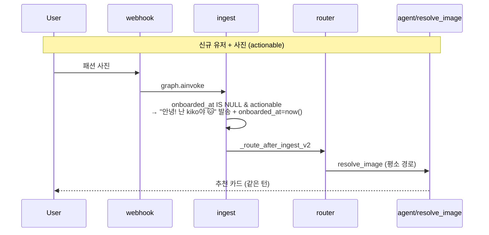

# 설계: 온보딩 friction 제거 (SPEC-ONBOARD-LITE-001)

> 작성일: 2026-05-19
> 상태: 설계 승인 대기
> 대상·목적: 신규 유저가 카드 퍼널에 가로막히지 않고 첫 메시지에서 바로 가치(추천)를 체험하도록 온보딩을 경량화. 카드 서브그래프 완전 제거.
> 검증 기준: 코드/마이그레이션 직접 확인 + 전체 `uv run pytest` 통과 + 삭제 모듈 import 잔존 0
> 베이스: `origin/dev` @ ecad552 (#28 포함)
> Supersedes: SPEC-ONBOARD-CARDS-001 (retired)
> Amends: SPEC-AGENT-V2-REACT (first_touch_intro 계약 변경)
> 범위 밖 (별도 SPEC): 취향 → v6 검색 랭킹 반영 ("루프 닫기")

---

## 1. 배경 / 진단

### 1.1 데이터 흐름 (코드 검증 결과)

```
온보딩 카드 선택 (mood 2~3 / color 2~3 / fit 1~2)
  → onboard_selections
  → _compute_card_weights (선택당 0.5)
  → seed_from_onboarding(user_key, merged)
  → TasteProfile.liked_keywords[kw] += min(0.5, 0.7)
  ↓ 유일 소비처
  app/agents/_memory_context.py:45  boost_keywords(5)
  → "liked_keywords: minimal, casual, mono" 텍스트 1줄
  → ReAct LLM system context 주입  ←★ 끝
```

### 1.2 확정된 결함

| # | 결함 | 근거 |
|---|------|------|
| 1 | 검색 0% 반영 | `search_service.py` / `search_repository.py` / `pipeline/search.py` taste 참조 grep 0건. v6 RPC 파라미터에 취향 슬롯 없음. 사진 경로는 이미지 임베딩 cosine만으로 랭킹 → `text_query` 미반영 |
| 2 | 첫 진입 가로챔 | `onboarding_required()` (`fashion_bot.py:98`): 신규 유저의 첫 메시지가 사진/링크/텍스트 무엇이든 카드 퍼널 강제 진입. 핵심 가치 체험 지연 |
| 3 | 비싼 Pinterest 서브플로우도 막다른 길 | Apify board/profile 스크래핑 → 같은 미반영 `liked_keywords`/`brand:`로 합류. 비용만 발생 |

핵심: **친화도 높은 온보딩을 만들었으나 결과물이 검색 랭킹에 도달하는 배선이 없고, 동시에 첫 진입을 막아 핵심 가치 체험을 지연**시킨다.

### 1.3 범위 결정 (사용자 합의)

- 이번 SPEC = **friction 제거만**. 취향이 검색 랭킹에 닿게 하는 "루프 닫기"는 별도 SPEC.
- 취향 학습은 현 상태(`update_taste` 툴, LLM 컨텍스트 한정) 유지 — "아직 검색 미반영"은 의도적으로 수용.

---

## 2. 목표 동작 (Architecture)

### 2.1 신규 유저 판별

`sess.onboarded_at IS NULL` — 유일하게 남기는 온보딩 시대 필드.

### 2.2 actionable 정의 (브리틀 NLU 회피)

- **actionable** = `msg.photo_file_id` OR `msg.urls` OR (비어있지 않은 `msg.text`, 단 `/start`-only 제외)
- **non-actionable** = photo·url 없음 AND (text 없음 OR text가 `/start` 단독)

"안녕" 같은 잡담 텍스트도 actionable로 분류 → ReAct agent가 kiko 페르소나로 자연 응대(상품군 질문/잡담). 정적 인트로는 `/start`-only / contentless 첫 메시지에만. 정규식 인사-분류 같은 불안정 NLU 도입하지 않음.

### 2.3 라우팅 (`_route_after_ingest_v2` in `fashion_bot.py`)

삭제: `onboarding_required` 분기, `is_continuous_pinterest` 분기, `first_touch_intro_required`→intro 분기.

신규 first-touch 처리:

```
contentless Update            → 기존 silent END 가드 (유지)
신규(onboarded_at IS NULL) + non-actionable  → intro 노드
신규 + actionable             → ingest 인라인 그리팅 후 평소 타깃(resolve_image / agent / pick_item) 같은 턴 진행
복귀(onboarded_at SET)        → 기존 동작 그대로 (그리팅 없음)
```

### 2.4 노드 변경

| 노드 | 변경 |
|------|------|
| `ingest` | 기존 인라인 핸들러(clarify / card:like / cards:more) 패턴과 동일하게 **first-touch 블록 추가**: `sess.onboarded_at is None` AND actionable → 한 줄 그리팅 발송(best-effort, 비치명적) + `sess.onboarded_at = now()` persist + first-touch `bot_text` emit. 이후 라우팅은 기존 분기 그대로 |
| `intro` | 내용 유지. 진입 조건만 "non-actionable 신규 유저"로 축소. 기존: 짧은 소개 + `onboarded_at` 마킹 + 턴 종료 (그대로) |

그리팅 문구(sticky lang):
- KO: `안녕! 난 kiko야 🐱 바로 찾아볼게요.`
- EN: `Hey! I'm kiko 🐱 — finding it now.`

### 2.5 시퀀스



---

## 3. 완전 삭제 목록

### 3.1 코드

| 분류 | 파일/심볼 |
|------|-----------|
| graph 노드 | `onboard_intro.py` `onboard_mood.py` `onboard_color.py` `onboard_fit.py` `onboard_pinterest.py` `pinterest_ingest.py` `_onboard_helpers.py` `_onboard_stage.py` `_pinterest_helpers.py` |
| channels | `onboarding_cards.py` `onboarding_values.py` `pinterest_url.py` |
| providers | `apify.py` |
| `fashion_bot.py` | onboard 노드 등록/엣지, `_ONBOARD_FIT_BRANCHES`, onboard import |
| `routing.py` | `onboarding_required` `_resolve_onboard_stage_target` `is_continuous_pinterest` `first_touch_intro_required` `_route_after_onboard_fit` `_is_restart_keyword` `_ONBOARDING_ACTIVE_STAGES` |
| `taste_profile.py` / `taste_profile_pg.py` | `seed_from_onboarding` (Protocol + InMemory + PG + `_aseed_from_onboarding`) |
| config | `core/config.py` + `.env.example` + `docs/infra/env.md`: `ONBOARDING_*` `PINTEREST_*` `APIFY_*` 및 restart keyword 셋 |

> [HARD] 구현 시 verification gate (코드 직접 확인 후 삭제):
> - `link_resolver.py` — 핵심 핀링크 흐름(`resolve_image`)이 사용하므로 **존치**. 삭제 금지. 구현 시 consumer 재확인.
> - `pinterest_url.py` — `resolve_image`/core 경로 비사용 확인 후에만 삭제. core 사용 발견 시 존치.
> - `seed_from_onboarding` — caller sweep로 온보딩/pinterest 외 호출자 0건 확정 후 제거.

### 3.2 테스트

- `tests/test_onboarding/` 전체 (~14)
- `tests/test_memory_pg/test_session_store_onboarding_columns.py`
- `tests/test_memory_pg/test_taste_seed_onboarding.py`
- `tests/test_graph_nodes/test_routing_onboarding.py`
- 공유 테스트 내 온보딩 케이스 (grep 스윕으로 식별)

### 3.3 SPEC / 문서

- `.moai/specs/SPEC-ONBOARD-CARDS-001` → 본 SPEC로 supersede 표기 (파일 보존, retirement note 추가)
- 신규 `.moai/specs/SPEC-ONBOARD-LITE-001` 생성
- `ai/CLAUDE.md` 동반 갱신: 디렉토리 트리(온보딩 노드 제거), 책임분리(Apify 행 제거), env feature flag 섹션, 핵심 파일 표
- SPEC-AGENT-V2-REACT 문서에 first_touch 계약 amend 노트

---

## 4. 세부 결정 (승인됨)

| 항목 | 결정 |
|------|------|
| Session 스키마 | **PG 컬럼 물리 존치**(nullable, 무시). `Session` 데이터클래스 필드 + `session_pg` SELECT/UPSERT 에서 `onboard_*`/`pin` 제거. 파괴적 migration 없음 — alembic head 유지. 추후 cleanup migration은 선택 |
| `/reset` | TasteProfile 초기화로 **용도 변경**. `/reset` (+ `취향 초기화` / `reset taste` 별칭) → 호출자 TasteProfile 삭제(`TasteProfileStore.delete`) + 짧은 ack. 카드 플로우 없음 |
| event_payloads | 온보딩 이벤트 TypedDict(`onboard_select`, `taste_update` source=onboard/pinterest) **존치**, emit 호출만 제거. event_payloads + AST 검증 테스트 churn 회피 |

---

## 5. 테스트 전략

신규 테스트:
- first-touch actionable (photo / url / text) → 그리팅 1줄 발송 + `onboarded_at` set + **같은 턴 추천 진행**
- first-touch non-actionable (`/start`-only, contentless) → intro + `onboarded_at` set + END
- 복귀 유저(`onboarded_at` set) → 그리팅 없음, 정상 흐름
- `/reset` (+ 별칭) → TasteProfile clear + ack

회귀:
- 전체 `uv run pytest` 통과
- `uv run ruff check .` 통과
- 삭제 모듈 import 잔존 0 (grep + import 에러 0)
- 핵심 핀링크 흐름(pinterest 링크 → 추천) 회귀 없음 (link_resolver 존치 검증)

---

## 6. 리스크 / 검증

| 리스크 | 완화 |
|--------|------|
| `link_resolver`/`pinterest_url` 공유 사용 | 삭제 전 consumer grep 필수. link_resolver 존치 고정 |
| prod(@kiko dev-ai) 신규 유저 흐름 변경 | rollout 시 dev-ai 로그로 first-touch 경로 실측 (메모리 레슨: live topology 확인). 배포는 본 SPEC 범위 밖, 별도 검증 |
| 삭제 모듈 잔존 import | ruff + pytest 전수 + grep 스윕 |
| 공유 테스트 내 온보딩 의존 | 삭제 후 전체 pytest로 회귀 검출 |
| 동시 세션(메인 체크아웃 dev) | 본 작업은 `.worktrees/onboarding-redesign` (브랜치 `fix/onboarding-redesign`) 완전 격리. 메인 체크아웃 브랜치 미관여 |

---

## 7. 코드 위치 (개념 → 파일:심볼)

| 개념 | 위치 |
|------|------|
| 라우팅 진입 분기 | `app/graphs/fashion_bot.py` `_route_after_ingest_v2` |
| first-touch 인라인 그리팅 | `app/graphs/nodes/ingest.py` (신규 블록) |
| non-actionable 인트로 | `app/graphs/nodes/intro.py` (진입조건 축소) |
| 신규 유저 판별 필드 | `app/infrastructure/memory/session.py` `Session.onboarded_at` |
| `/reset` → taste clear | `app/graphs/nodes/ingest.py` 인라인 + `TasteProfileStore.delete` |
| 삭제 대상 라우팅 술어 | `app/graphs/routing.py` |
| 삭제 대상 온보딩 노드 | `app/graphs/nodes/onboard_*.py` 등 (3.1 표) |
